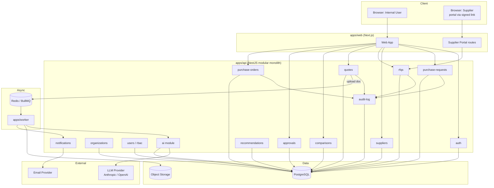
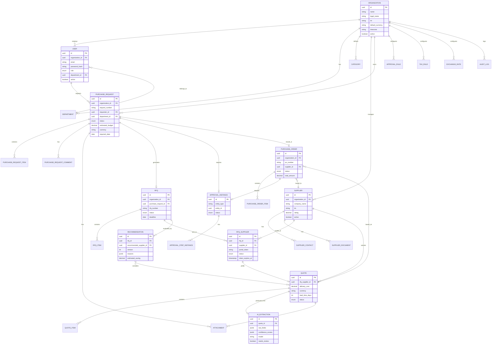
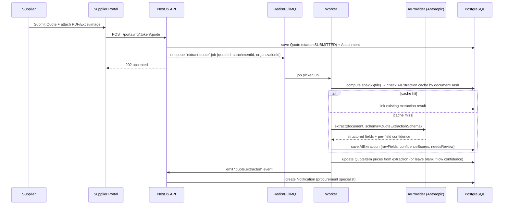

# TOP PROCUREMENT — ARCHITECTURE v1 (MVP)

Статус: **Locked for implementation start.** Основано на `TOP Procurement.md` (полное видение) и `TOP Procurement — CTO Decision Lock.md` (зафиксированные решения). Этот документ — единственный источник истины для старта разработки. Код не пишется, пока раздел 12 (Open Decisions) не закрыт.

---

## 1. Final Architecture

### 1.1 Стиль архитектуры

**Modular monolith**, не микросервисы. Один деплоюмый backend (NestJS), разбитый на изолированные feature-модули с чёткими границами, один frontend (Next.js), один worker для async-задач. Причина: на MVP-стадии стоимость координации распределённой системы (сеть, трассировка, eventual consistency) выше, чем цена рефакторинга монолита в будущем. Модульность закладывается так, чтобы любой модуль (например `ai`) можно было вынести в отдельный сервис позже без переписывания бизнес-логики (module boundaries = будущие service boundaries).

### 1.2 Компоненты

```text
apps/web      — Next.js, весь UI (внутренние пользователи + Supplier Portal как отдельный route-namespace)
apps/api      — NestJS, REST API, вся бизнес-логика, авторизация, AI orchestration
apps/worker   — BullMQ consumer: OCR/AI extraction, email, PDF/XLSX generation, notifications
postgres      — единственный источник правды, все данные
redis         — очереди (BullMQ) + кэш сессий/rate-limit
object-storage — S3-совместимое хранилище (MinIO локально / S3 или R2 в проде) — только файлы, не БД
```

### 1.3 Диаграмма



### 1.4 Request flow (пример: закупщик открывает сравнение КП)

```text
Browser → Next.js (SSR/CSR) → NestJS /comparisons/:rfqId
  → guard: JWT valid?
  → guard: user.organization_id === resource.organization_id?  (tenant isolation, ВСЕГДА первая проверка после auth)
  → guard: role allows READ comparisons?
  → service: load Quotes + normalize (currency, VAT, delivery) → Total Cost
  → service: load latest Recommendation (if exists) or trigger AI on-demand
  → response: comparison table + recommendation + confidence
```

### 1.5 Tenant isolation — как именно реализуется

Multi-tenancy — приоритет №1 (см. раздел 31 Decision Lock). Реализация на нескольких независимых уровнях, чтобы ни одна ошибка в коде не привела к утечке данных между организациями:

1. **Database**: у каждой tenant-owned таблицы обязательное поле `organization_id` (NOT NULL, indexed, часть composite index с основным полем поиска).
2. **ORM**: все Prisma-запросы идут через тонкий repository layer, который **не позволяет** вызвать `findMany`/`findUnique` без `organization_id` в `where` — обеспечивается кастомным Prisma Client Extension, который инжектит `organization_id` из request-context и бросает исключение, если контекста нет.
3. **API**: `organization_id` никогда не принимается из тела запроса/query от клиента — только из JWT claims текущего пользователя.
4. **Authorization guard**: отдельный `TenantGuard`, выполняется до `RolesGuard`, на каждом защищённом эндпоинте.
5. **Background jobs**: каждая job в очереди несёт `organization_id` в payload; worker обязан передать его во все нижестоящие вызовы (AI, storage, notifications).
6. **Storage**: object keys в S3 включают `org_{organization_id}/...` префикс; presigned URL генерируется только после проверки владения.
7. **Тестирование**: интеграционный тест-сьют содержит обязательный класс тестов "Tenant A never sees Tenant B" для каждого модуля (см. раздел 12 Risks).

### 1.6 Окружения и деплой (высокий уровень, детали — Milestone 8)

```text
development → docker compose (postgres, redis, minio, api, worker, web)
staging     → тот же образ, что и prod, отдельная БД/бакет
production  → Docker images, managed Postgres, managed Redis, S3/R2
```

---

## 2. Final MVP Scope

Фиксирую как есть в CTO Decision Lock — это финальный скоуп, никаких добавлений без прохождения "CTO Decision Rule" (раздел 34 Decision Lock).

**Core workflow (единственное, что обязано работать end-to-end):**

```text
Purchase Request → Supplier Selection → RFQ → Supplier Portal → Quote
  → AI Extraction → Quote Normalization → Quote Comparison
  → AI Recommendation → Human Approval → Purchase Order
```

**В скоупе:** Auth, Multi-tenant Org, RBAC (6 фиксированных ролей), Purchase Request (CRUD+approval+comments+attachments), Supplier CRUD (basic rating, без risk engine), RFQ, Supplier Portal (без аккаунта, secure link), Quote (нормализованная структура), AI Document Extraction (PDF/Excel/image → structured + confidence), Quote Normalization, Quote Comparison (таблица + sorting + highlighting + export), AI Recommendation (explainable, non-binding), Approval (configurable threshold, не hardcoded), Purchase Order, минимальный Dashboard.

**Явно вне MVP** (Phase 2/3, не блокируют релиз): SAP Business One, Didox, E-IMZO, Invoice, 3-Way Match, Inventory, BOM, Forecasting, Advanced Budget, Contracts, Advanced Supplier Risk, Marketplace, Mobile native, Telegram, WhatsApp, Electronic Auctions, Advanced Analytics, Product Master с SKU/dedup (см. решение в разделе 3.2).

---

## 3. Domain Model

### 3.1 Основные агрегаты

```text
Organization (tenant root)
 ├─ User (role: enum, не отдельная таблица Permission)
 ├─ Department
 ├─ Category (плоский lookup, для Supplier и PurchaseRequest)
 ├─ Supplier
 │   ├─ SupplierContact
 │   └─ SupplierDocument
 ├─ PurchaseRequest
 │   ├─ PurchaseRequestItem
 │   ├─ PurchaseRequestComment
 │   └─ Attachment (polymorphic)
 ├─ RFQ (создаётся из PurchaseRequest)
 │   ├─ RFQItem (копия PurchaseRequestItem на момент отправки)
 │   └─ RFQSupplier (join: RFQ × Supplier, несёт portal-token и статус)
 ├─ Quote (подаётся Supplier через RFQSupplier)
 │   └─ QuoteItem
 ├─ AIExtraction (результат обработки документа КП, привязан к Quote)
 ├─ Recommendation (AI-вывод по RFQ, версионируемый, привязан к Quotes)
 ├─ ApprovalRule (конфигурация threshold → approver_role)
 ├─ ApprovalInstance (факт прохождения approval для PR или PO)
 │   └─ ApprovalStepInstance
 ├─ PurchaseOrder (создаётся из PR + выбранного Quote)
 │   └─ PurchaseOrderItem
 ├─ Currency / ExchangeRate
 ├─ TaxRule
 ├─ Notification
 └─ AuditLog
```

### 3.2 Решения по домену, принятые самостоятельно (флаг: требуют вашего подтверждения — см. раздел 12)

- **Product Master исключён из MVP.** Оригинальная спецификация (разделы 50–51 `TOP Procurement.md`) описывает полноценный справочник товаров с SKU, aliases, duplicate detection. CTO Decision Lock его не требует явно, а состав полей `PurchaseRequestItem` (раздел 4 Decision Lock) — это свободный текст (`item`, `description`), без SKU. Поэтому в MVP товар — денормализованное поле на `PurchaseRequestItem`/`RFQItem`/`QuoteItem`, без отдельной сущности. **Причина:** Product Master с dedup — это отдельная AI-функция (раздел 51 исходного видения), она не нужна для доказательства core-гипотезы и добавляет сложность (нормализация "КГ 4×16" vs "КГ-4х16"). **Риск:** если этого не будет, сравнение КП по разным RFQ не сможет автоматически построить историю цен по товару — history строится по free-text match (слабее). Решение: Phase 2.
- **AI Conversational Assistant ("Ask TOP AI", глобальная кнопка, разделы 100–101 исходного видения) — вне MVP.** Decision Lock требует только двух встроенных AI-функций: AI Extraction и AI Recommendation, обе не диалоговые, а detiministically triggered на конкретных шагах workflow. Полноценный чат с read-only query tools (`searchSuppliers`, `getPriceHistory` и т.д.) добавляет отдельный поверхностный слой (AIConversation/AIMessage/AIToolCall), не участвующий в core workflow. Классификация по правилу раздела 34: не блокирует MVP → **Phase 2**.
- **RBAC — enum, не таблицы Role/Permission.** Decision Lock прямо требует "не создавать сложную permission system без необходимости" и даёт фиксированный список из 6 ролей. Роль хранится как `enum` на `User`, проверка — через decorator + guard на каждом endpoint. Динамическая матрица прав (кастомизируемая по организациям) — Phase 2, если появится запрос от пилотных клиентов.
- **Exchange rate — ручной, не live-фид.** Для MVP валюты (UZS/USD/EUR) сравниваются по курсу, который задаёт админ организации в таблице `ExchangeRate` (дата действия + курс). Автоматическая интеграция с ЦБ РУз — Phase 2.
- **OCR/Extraction pipeline упрощён.** Вместо двухэтапного OCR-движка + отдельного NLP-парсинга (раздел 21 исходного видения) используется **vision-capable LLM напрямую** на изображениях/PDF-страницах КП (передаём в модель как есть, просим structured output по JSON-schema с полями + confidence на каждое поле). Отдельный OCR-сервис (Tesseract и т.п.) не поднимается. **Причина:** современные LLM с vision справляются с большинством PDF/сканов КП без отдельного OCR-этапа, это меньше инфраструктуры для MVP. **Риск:** на плохих сканах/рукописных пометках точность может просесть — при confidence < threshold документ уходит в `Needs Review`, это уже заложено как обязательный fallback (раздел 9 Decision Lock).

---

## 4. ERD



---

## 5. Database Schema

PostgreSQL + Prisma. Ниже — рабочая версия `schema.prisma` (сокращённые директивы `@@index`/`@@map` опущены там, где очевидны — добавляются на этапе реализации). Все деньги — `Decimal`. Все tenant-owned модели содержат `organizationId`.

```prisma
generator client {
  provider = "prisma-client-js"
}

datasource db {
  provider = "postgresql"
  url      = env("DATABASE_URL")
}

// ────────────────────────────────────────────────────────────
// ENUMS
// ────────────────────────────────────────────────────────────

enum UserRole {
  ADMIN
  PROCUREMENT_MANAGER
  PROCUREMENT_SPECIALIST
  APPROVER
  EMPLOYEE
  SUPPLIER // используется только для полноты enum; supplier-пользователи в MVP не имеют логина, доступ через portal token
}

enum PurchaseRequestStatus {
  DRAFT
  SUBMITTED
  UNDER_APPROVAL
  APPROVED
  REJECTED
  RFQ_IN_PROGRESS
  PO_CREATED
  CLOSED
  CANCELLED
}

enum RfqStatus {
  DRAFT
  SENT
  IN_PROGRESS
  CLOSED
  CANCELLED
}

enum RfqSupplierStatus {
  INVITED
  VIEWED
  SUBMITTED
  DECLINED
  EXPIRED
}

enum QuoteStatus {
  SUBMITTED
  NEEDS_REVIEW
  VERIFIED
  REJECTED
}

enum ApprovalEntityType {
  PURCHASE_REQUEST
  PURCHASE_ORDER
}

enum ApprovalStatus {
  PENDING
  APPROVED
  REJECTED
}

enum PurchaseOrderStatus {
  DRAFT
  PENDING_APPROVAL
  APPROVED
  SENT
  CONFIRMED
  CANCELLED
}

enum AttachmentOwnerType {
  PURCHASE_REQUEST
  QUOTE
  SUPPLIER
  PURCHASE_ORDER
}

// ────────────────────────────────────────────────────────────
// TENANCY / IDENTITY
// ────────────────────────────────────────────────────────────

model Organization {
  id              String   @id @default(uuid())
  name            String
  legalName       String?
  tin             String?
  defaultCurrency String   @default("UZS")
  timezone        String   @default("Asia/Tashkent")
  active          Boolean  @default(true)
  createdAt       DateTime @default(now())
  updatedAt       DateTime @updatedAt

  users            User[]
  departments      Department[]
  categories       Category[]
  suppliers        Supplier[]
  purchaseRequests PurchaseRequest[]
  rfqs             RFQ[]
  purchaseOrders   PurchaseOrder[]
  approvalRules    ApprovalRule[]
  taxRules         TaxRule[]
  exchangeRates    ExchangeRate[]
  auditLogs        AuditLog[]
  notifications    Notification[]
}

model User {
  id             String       @id @default(uuid())
  organizationId String
  organization   Organization @relation(fields: [organizationId], references: [id])
  email          String
  passwordHash   String
  fullName       String
  role           UserRole
  departmentId   String?
  department     Department?  @relation(fields: [departmentId], references: [id])
  active         Boolean      @default(true)
  lastLoginAt    DateTime?
  createdAt      DateTime     @default(now())
  updatedAt      DateTime     @updatedAt

  purchaseRequests PurchaseRequest[] @relation("Requester")

  @@unique([organizationId, email])
  @@index([organizationId])
}

model Department {
  id             String       @id @default(uuid())
  organizationId String
  organization   Organization @relation(fields: [organizationId], references: [id])
  name           String

  users             User[]
  purchaseRequests  PurchaseRequest[]

  @@unique([organizationId, name])
}

model Category {
  id             String       @id @default(uuid())
  organizationId String
  organization   Organization @relation(fields: [organizationId], references: [id])
  name           String
  active         Boolean      @default(true)

  suppliers        SupplierCategory[]
  purchaseRequests PurchaseRequest[]

  @@unique([organizationId, name])
}

// ────────────────────────────────────────────────────────────
// SUPPLIERS
// ────────────────────────────────────────────────────────────

model Supplier {
  id             String       @id @default(uuid())
  organizationId String
  organization   Organization @relation(fields: [organizationId], references: [id])
  companyName    String
  legalName      String?
  tin            String?
  country        String?
  address        String?
  bankName       String?
  mfo            String?
  bankAccount    String?
  rating         Decimal?     @db.Decimal(5, 2) // 0.00–100.00, ручной/расчётный базовый рейтинг
  active         Boolean      @default(true)
  createdAt      DateTime     @default(now())
  updatedAt      DateTime     @updatedAt

  categories     SupplierCategory[]
  contacts       SupplierContact[]
  documents      SupplierDocument[]
  rfqSuppliers   RFQSupplier[]
  purchaseOrders PurchaseOrder[]

  @@index([organizationId])
}

model SupplierCategory {
  supplierId String
  supplier   Supplier @relation(fields: [supplierId], references: [id])
  categoryId String
  category   Category @relation(fields: [categoryId], references: [id])

  @@id([supplierId, categoryId])
}

model SupplierContact {
  id         String   @id @default(uuid())
  supplierId String
  supplier   Supplier @relation(fields: [supplierId], references: [id])
  fullName   String
  phone      String?
  email      String?
  telegram   String?
  isPrimary  Boolean  @default(false)
}

model SupplierDocument {
  id           String   @id @default(uuid())
  supplierId   String
  supplier     Supplier @relation(fields: [supplierId], references: [id])
  attachmentId String
  attachment   Attachment @relation(fields: [attachmentId], references: [id])
  docType      String   // e.g. "license", "certificate"
  createdAt    DateTime @default(now())
}

// ────────────────────────────────────────────────────────────
// PURCHASE REQUEST
// ────────────────────────────────────────────────────────────

model PurchaseRequest {
  id               String                @id @default(uuid())
  organizationId   String
  organization     Organization          @relation(fields: [organizationId], references: [id])
  requestNumber    String
  requesterId      String
  requester        User                  @relation("Requester", fields: [requesterId], references: [id])
  departmentId     String?
  department       Department?           @relation(fields: [departmentId], references: [id])
  categoryId       String?
  category         Category?             @relation(fields: [categoryId], references: [id])
  status           PurchaseRequestStatus @default(DRAFT)
  estimatedBudget  Decimal?              @db.Decimal(18, 2)
  currency         String                @default("UZS")
  priority         String                @default("normal") // low|normal|high|urgent
  requiredDate     DateTime?
  reason           String?
  aiGenerated      Boolean               @default(false)
  createdAt        DateTime              @default(now())
  updatedAt        DateTime              @updatedAt
  submittedAt      DateTime?

  items          PurchaseRequestItem[]
  comments       PurchaseRequestComment[]
  rfqs           RFQ[]
  approvalInstance ApprovalInstance?
  purchaseOrders PurchaseOrder[]

  @@unique([organizationId, requestNumber])
  @@index([organizationId, status])
}

model PurchaseRequestItem {
  id                String          @id @default(uuid())
  purchaseRequestId String
  purchaseRequest   PurchaseRequest @relation(fields: [purchaseRequestId], references: [id])
  itemName          String
  description       String?
  quantity          Decimal         @db.Decimal(18, 3)
  unit              String
  technicalSpec     Json?           // free-form, category-agnostic in MVP
}

model PurchaseRequestComment {
  id                String          @id @default(uuid())
  purchaseRequestId String
  purchaseRequest   PurchaseRequest @relation(fields: [purchaseRequestId], references: [id])
  authorId          String
  body              String
  createdAt         DateTime        @default(now())
}

// ────────────────────────────────────────────────────────────
// RFQ
// ────────────────────────────────────────────────────────────

model RFQ {
  id                String          @id @default(uuid())
  organizationId    String
  organization      Organization    @relation(fields: [organizationId], references: [id])
  purchaseRequestId String
  purchaseRequest   PurchaseRequest @relation(fields: [purchaseRequestId], references: [id])
  rfqNumber         String
  status            RfqStatus       @default(DRAFT)
  deadline          DateTime
  createdById       String
  createdAt         DateTime        @default(now())
  sentAt            DateTime?

  items         RFQItem[]
  suppliers     RFQSupplier[]
  recommendations Recommendation[]

  @@unique([organizationId, rfqNumber])
  @@index([organizationId, status])
}

model RFQItem {
  id            String  @id @default(uuid())
  rfqId         String
  rfq           RFQ     @relation(fields: [rfqId], references: [id])
  itemName      String
  description   String?
  quantity      Decimal @db.Decimal(18, 3)
  unit          String
  technicalSpec Json?

  quoteItems QuoteItem[]
}

model RFQSupplier {
  id              String            @id @default(uuid())
  rfqId           String
  rfq             RFQ               @relation(fields: [rfqId], references: [id])
  supplierId      String
  supplier        Supplier          @relation(fields: [supplierId], references: [id])
  portalToken     String            @unique // opaque, signed separately as JWT for transport
  tokenExpiresAt  DateTime
  status          RfqSupplierStatus @default(INVITED)
  invitedAt       DateTime          @default(now())
  viewedAt        DateTime?

  quote Quote?

  @@unique([rfqId, supplierId])
}

// ────────────────────────────────────────────────────────────
// QUOTE
// ────────────────────────────────────────────────────────────

model Quote {
  id             String       @id @default(uuid())
  rfqSupplierId  String       @unique
  rfqSupplier    RFQSupplier  @relation(fields: [rfqSupplierId], references: [id])
  currency       String
  vatRate        Decimal?     @db.Decimal(5, 2)
  vatIncluded    Boolean      @default(false)
  deliveryCost   Decimal      @default(0) @db.Decimal(18, 2)
  deliveryIncluded Boolean    @default(false)
  leadTimeDays   Int?
  paymentTerms   String?
  warranty       String?
  notes          String?
  status         QuoteStatus  @default(SUBMITTED)
  submittedAt    DateTime     @default(now())

  items         QuoteItem[]
  extraction    AIExtraction?
  attachments   Attachment[]
  purchaseOrders PurchaseOrder[]

  @@index([status])
}

model QuoteItem {
  id         String  @id @default(uuid())
  quoteId    String
  quote      Quote   @relation(fields: [quoteId], references: [id])
  rfqItemId  String
  rfqItem    RFQItem @relation(fields: [rfqItemId], references: [id])
  unitPrice  Decimal @db.Decimal(18, 4)
  quantity   Decimal @db.Decimal(18, 3)
}

model AIExtraction {
  id               String   @id @default(uuid())
  quoteId          String   @unique
  quote            Quote    @relation(fields: [quoteId], references: [id])
  sourceAttachmentId String
  documentHash     String   // sha256, для AI cache / re-processing skip
  model            String
  rawFields        Json     // extracted key→value before normalization
  confidenceScores Json     // { field: number(0..1) }
  needsReview      Boolean  @default(false)
  reviewedById     String?
  reviewedAt       DateTime?
  createdAt        DateTime @default(now())

  @@index([documentHash])
}

// ────────────────────────────────────────────────────────────
// RECOMMENDATION (AI, versioned, audit-able)
// ────────────────────────────────────────────────────────────

model Recommendation {
  id                   String   @id @default(uuid())
  rfqId                String
  rfq                  RFQ      @relation(fields: [rfqId], references: [id])
  version              Int      @default(1)
  recommendedSupplierId String
  reasons              Json     // string[] с explainable факторами
  estimatedSaving      Decimal? @db.Decimal(18, 2)
  cheapestSupplierId   String?
  fastestSupplierId    String?
  model                String
  inputSnapshot        Json     // quotes + normalized values на момент генерации (auditability)
  createdAt            DateTime @default(now())
  acceptedById         String?
  acceptedAt           DateTime?
  overridden           Boolean  @default(false) // true, если человек выбрал не рекомендованного

  @@index([rfqId, version])
}

// ────────────────────────────────────────────────────────────
// APPROVAL ENGINE
// ────────────────────────────────────────────────────────────

model ApprovalRule {
  id             String       @id @default(uuid())
  organizationId String
  organization   Organization @relation(fields: [organizationId], references: [id])
  entityType     ApprovalEntityType
  minAmount      Decimal      @db.Decimal(18, 2)
  maxAmount      Decimal?     @db.Decimal(18, 2) // null = без верхней границы
  approverRole   UserRole
  stepOrder      Int          @default(1)
  active         Boolean      @default(true)

  @@index([organizationId, entityType, active])
}

model ApprovalInstance {
  id                String             @id @default(uuid())
  entityType        ApprovalEntityType
  purchaseRequestId String?            @unique
  purchaseRequest   PurchaseRequest?   @relation(fields: [purchaseRequestId], references: [id])
  purchaseOrderId   String?            @unique
  purchaseOrder     PurchaseOrder?     @relation(fields: [purchaseOrderId], references: [id])
  status            ApprovalStatus     @default(PENDING)
  createdAt         DateTime           @default(now())
  completedAt       DateTime?

  steps ApprovalStepInstance[]
}

model ApprovalStepInstance {
  id                 String           @id @default(uuid())
  approvalInstanceId String
  approvalInstance   ApprovalInstance @relation(fields: [approvalInstanceId], references: [id])
  stepOrder          Int
  approverRole       UserRole
  assignedUserId     String?
  status             ApprovalStatus   @default(PENDING)
  decidedById        String?
  decidedAt          DateTime?
  comment            String?
}

// ────────────────────────────────────────────────────────────
// PURCHASE ORDER
// ────────────────────────────────────────────────────────────

model PurchaseOrder {
  id                String              @id @default(uuid())
  organizationId    String
  organization      Organization        @relation(fields: [organizationId], references: [id])
  poNumber          String
  purchaseRequestId String
  purchaseRequest   PurchaseRequest     @relation(fields: [purchaseRequestId], references: [id])
  supplierId        String
  supplier          Supplier            @relation(fields: [supplierId], references: [id])
  quoteId           String
  quote             Quote               @relation(fields: [quoteId], references: [id])
  status            PurchaseOrderStatus @default(DRAFT)
  currency          String
  totalAmount       Decimal             @db.Decimal(18, 2)
  paymentTerms       String?
  expectedDeliveryDate DateTime?
  createdById       String
  createdAt         DateTime            @default(now())

  items            PurchaseOrderItem[]
  approvalInstance ApprovalInstance?

  @@unique([organizationId, poNumber])
}

model PurchaseOrderItem {
  id              String        @id @default(uuid())
  purchaseOrderId String
  purchaseOrder   PurchaseOrder @relation(fields: [purchaseOrderId], references: [id])
  itemName        String
  quantity        Decimal       @db.Decimal(18, 3)
  unit            String
  unitPrice       Decimal       @db.Decimal(18, 4)
}

// ────────────────────────────────────────────────────────────
// FINANCE CONFIG
// ────────────────────────────────────────────────────────────

model TaxRule {
  id             String       @id @default(uuid())
  organizationId String
  organization   Organization @relation(fields: [organizationId], references: [id])
  taxType        String       @default("VAT")
  rate           Decimal      @db.Decimal(5, 2)
  effectiveFrom  DateTime
  effectiveTo    DateTime?
  active         Boolean      @default(true)
}

model ExchangeRate {
  id             String       @id @default(uuid())
  organizationId String
  organization   Organization @relation(fields: [organizationId], references: [id])
  fromCurrency   String
  toCurrency     String
  rate           Decimal      @db.Decimal(18, 6)
  effectiveDate  DateTime

  @@unique([organizationId, fromCurrency, toCurrency, effectiveDate])
}

// ────────────────────────────────────────────────────────────
// CROSS-CUTTING
// ────────────────────────────────────────────────────────────

model Attachment {
  id            String              @id @default(uuid())
  organizationId String
  ownerType     AttachmentOwnerType
  ownerId       String
  fileName      String
  mimeType      String
  sizeBytes     Int
  storageKey    String              // S3 object key, includes org_{id}/ prefix
  uploadedById  String
  createdAt     DateTime            @default(now())

  quote             Quote?             @relation(fields: [quoteId], references: [id])
  quoteId           String?
  supplierDocuments SupplierDocument[]

  @@index([organizationId, ownerType, ownerId])
}

model Notification {
  id             String       @id @default(uuid())
  organizationId String
  organization   Organization @relation(fields: [organizationId], references: [id])
  userId         String
  type           String       // e.g. "PR_SUBMITTED", "QUOTE_RECEIVED", "APPROVAL_REQUIRED"
  channel        String       // "IN_APP" | "EMAIL"
  payload        Json
  readAt         DateTime?
  createdAt      DateTime     @default(now())

  @@index([organizationId, userId, readAt])
}

model AuditLog {
  id             String       @id @default(uuid())
  organizationId String
  organization   Organization @relation(fields: [organizationId], references: [id])
  userId         String?
  action         String       // e.g. "PR_APPROVED", "QUOTE_PRICE_CORRECTED"
  entityType     String
  entityId       String
  oldValue       Json?
  newValue       Json?
  ipAddress      String?
  createdAt      DateTime     @default(now())

  @@index([organizationId, entityType, entityId])
}
```

**Примечание по неизменяемости AuditLog:** на уровне БД у роли приложения (`app_user`) нет `DELETE`/`UPDATE` grant на таблицу `audit_log` — только `INSERT`/`SELECT`. Это защищает от "обычного пользователя", как требует раздел 46 исходного видения, даже если баг в коде попытается удалить запись.

---

## 6. RBAC Matrix

Роли фиксированы (enum `UserRole`). Supplier — не логинится в основной системе, доступ через **RFQSupplier.portalToken** (не пароль), поэтому в матрице отдельная колонка с иным механизмом доступа.

| Действие | Admin | Procurement Manager | Procurement Specialist | Approver | Employee | Supplier (portal token) |
|---|:---:|:---:|:---:|:---:|:---:|:---:|
| Создать Purchase Request | ✓ | ✓ | ✓ | – | ✓ (свои) | – |
| Просмотр всех PR организации | ✓ | ✓ | ✓ | ✓ (только назначенные ему на approval) | – | – |
| Просмотр своих PR | ✓ | ✓ | ✓ | ✓ | ✓ | – |
| Редактировать PR (черновик) | ✓ | ✓ | ✓ | – | ✓ (свои, пока DRAFT) | – |
| Отправить PR на согласование | ✓ | ✓ | ✓ | – | ✓ (свои) | – |
| Согласовать/отклонить PR | ✓ | ✓ (если попадает в его threshold) | – | ✓ (если попадает в его threshold) | – | – |
| CRUD Supplier | ✓ | ✓ | ✓ | – | – | – (может видеть/редактировать только свой профиль через portal — Phase 2) |
| Создать RFQ, выбрать поставщиков | ✓ | ✓ | ✓ | – | – | – |
| Отправить RFQ | ✓ | ✓ | ✓ | – | – | – |
| Просмотр RFQ по ссылке, подача Quote | – | – | – | – | – | ✓ (только своя RFQSupplier запись) |
| Просмотр Quotes / Comparison | ✓ | ✓ | ✓ | ✓ (только по своим approval-задачам) | – | – |
| Исправить extracted поля Quote (review) | ✓ | ✓ | ✓ | – | – | – |
| Запросить AI Recommendation | ✓ | ✓ | ✓ | – | – | – |
| Принять / отклонить Recommendation (выбор поставщика) | ✓ | ✓ | ✓ | – | – | – |
| Создать Purchase Order | ✓ | ✓ | ✓ | – | – | – |
| Согласовать PO | ✓ | ✓ (если в его threshold) | – | ✓ (если в его threshold) | – | – |
| Просмотр Dashboard (org-wide) | ✓ | ✓ | – (только свои закупки) | – | – | – |
| Управление Organization/Users/Categories/TaxRule/ApprovalRule | ✓ | – | – | – | – | – |
| Просмотр Audit Log | ✓ | ✓ (read-only) | – | – | – | – |

Правило по умолчанию: **deny**. Любой endpoint без явного разрешения в матрице закрыт guard'ом.

---

## 7. API Specification

REST, версионируется через префикс `/api/v1`. Полный OpenAPI генерируется автоматически из NestJS decorators (`@nestjs/swagger`) — здесь фиксируется состав ресурсов и контракт на уровне MVP.

```text
POST   /api/v1/auth/login
POST   /api/v1/auth/logout
POST   /api/v1/auth/refresh
POST   /api/v1/auth/password-reset/request
POST   /api/v1/auth/password-reset/confirm
GET    /api/v1/auth/me

GET    /api/v1/organizations/current
PATCH  /api/v1/organizations/current          (Admin)

GET    /api/v1/users
POST   /api/v1/users                          (Admin)
PATCH  /api/v1/users/:id                      (Admin)
DELETE /api/v1/users/:id                      (Admin, soft-delete)

GET    /api/v1/departments
POST   /api/v1/departments                    (Admin)

GET    /api/v1/categories
POST   /api/v1/categories                     (Admin)

GET    /api/v1/suppliers
POST   /api/v1/suppliers
GET    /api/v1/suppliers/:id
PATCH  /api/v1/suppliers/:id
GET    /api/v1/suppliers/:id/contacts
POST   /api/v1/suppliers/:id/contacts
POST   /api/v1/suppliers/:id/documents

GET    /api/v1/purchase-requests
POST   /api/v1/purchase-requests
GET    /api/v1/purchase-requests/:id
PATCH  /api/v1/purchase-requests/:id
POST   /api/v1/purchase-requests/:id/submit
POST   /api/v1/purchase-requests/:id/approve      (Approver/Procurement Manager)
POST   /api/v1/purchase-requests/:id/reject
POST   /api/v1/purchase-requests/:id/comments
POST   /api/v1/purchase-requests/:id/attachments
POST   /api/v1/purchase-requests/ai-draft         (текст → структурированный PR draft, не блокирует ручное создание)

POST   /api/v1/rfqs                               (из purchase_request_id + supplier_ids + deadline)
GET    /api/v1/rfqs/:id
POST   /api/v1/rfqs/:id/send
GET    /api/v1/rfqs/:id/suppliers                 (статусы приглашённых поставщиков)

GET    /api/v1/portal/rfq/:token                  (публичный, без auth — валидация по token+expiry)
POST   /api/v1/portal/rfq/:token/quote             (Submit Quote, публичный)
POST   /api/v1/portal/rfq/:token/quote/attachments

GET    /api/v1/quotes/:id
PATCH  /api/v1/quotes/:id                          (ручная коррекция после AI extraction)
POST   /api/v1/quotes/:id/verify                   (пометить Needs Review как проверено)

GET    /api/v1/rfqs/:id/comparison                  (нормализованная сравнительная таблица)
POST   /api/v1/rfqs/:id/recommendation              (запуск AI Recommendation)
GET    /api/v1/rfqs/:id/recommendation/latest
POST   /api/v1/rfqs/:id/recommendation/:recId/accept
POST   /api/v1/rfqs/:id/recommendation/:recId/reject

POST   /api/v1/purchase-orders                     (из purchase_request_id + quote_id)
GET    /api/v1/purchase-orders/:id
POST   /api/v1/purchase-orders/:id/approve
POST   /api/v1/purchase-orders/:id/send
PATCH  /api/v1/purchase-orders/:id/status

GET    /api/v1/approval-rules                      (Admin)
POST   /api/v1/approval-rules                      (Admin)
PATCH  /api/v1/approval-rules/:id                  (Admin)

GET    /api/v1/tax-rules                           (Admin)
POST   /api/v1/tax-rules                           (Admin)
GET    /api/v1/exchange-rates                      (Admin)
POST   /api/v1/exchange-rates                      (Admin)

GET    /api/v1/notifications
POST   /api/v1/notifications/:id/read

GET    /api/v1/dashboard/summary                   (карточки: open requests, active RFQs, quotes received, pending approvals, POs, potential savings)
GET    /api/v1/dashboard/procurement-by-month

GET    /api/v1/audit-log                           (Admin/Procurement Manager, read-only, фильтры по entity)

POST   /api/v1/ai/extract-quote                     (внутренний, вызывается worker'ом после upload)
```

**Аутентификация:** JWT access token (15 мин) + refresh token (7 дней, httpOnly secure cookie) для внутренних пользователей. Supplier Portal endpoints (`/portal/*`) не используют JWT пользователя — используют подписанный `portalToken` (JWT с claims `rfqSupplierId`, `exp`), который сам является granular, single-purpose credential.

---

## 8. Frontend Screen Map

```text
/login
/forgot-password
/reset-password

/dashboard                                    — KPI карточки + Procurement by Month

/requests                                     — список PR (фильтр по статусу/department)
/requests/new                                 — форма создания (+ опциональный AI-draft из текста)
/requests/:id                                 — детали, items, comments, attachments, approval status

/suppliers
/suppliers/new
/suppliers/:id                                — профиль, contacts, documents, rating, история RFQ

/rfqs
/rfqs/new?purchaseRequestId=...                — выбор поставщиков + deadline
/rfqs/:id                                     — статус приглашений (invited/viewed/submitted)
/rfqs/:id/comparison                          — ГЛАВНЫЙ экран: таблица сравнения + AI Recommendation + Approve/Reject/Compare Manually

/purchase-orders
/purchase-orders/:id

/approvals                                    — очередь "требует моего решения" (PR + PO)

/settings/organization                        (Admin)
/settings/users                               (Admin)
/settings/categories                          (Admin)
/settings/approval-rules                      (Admin)
/settings/tax-rules                           (Admin)
/settings/exchange-rates                      (Admin)

── Supplier Portal (отдельный layout, без основной навигации) ──
/portal/rfq/[token]                            — просмотр RFQ + форма Submit Quote
/portal/rfq/[token]/submitted                  — подтверждение
```

Мобильный сценарий MVP (responsive, не native): `/approvals` и `/dashboard` — приоритет для мобильной адаптации (директор/approver принимает решения с телефона), остальное — desktop-first.

---

## 9. AI Architecture

### 9.1 Расположение

AI — **NestJS-модуль внутри `apps/api`**, не отдельный сервис (см. решение раздела 21 Decision Lock). Тяжёлые операции (extraction документа) уходят в очередь и выполняются в `apps/worker`, но используют тот же `ai` package с бизнес-логикой (`packages/ai`), чтобы не дублировать код между api и worker.

```text
packages/ai/
  src/
    provider.interface.ts        — AIProvider (chat, extract, classify)
    providers/
      anthropic.provider.ts
      openai.provider.ts         — на будущее, тот же интерфейс
    tools/
      extract-quote.tool.ts      — структурированное извлечение из документа КП
      generate-recommendation.tool.ts
      draft-purchase-request.tool.ts
    schemas/
      quote-extraction.schema.ts — JSON schema для structured output
      recommendation.schema.ts
    orchestrator.ts              — маршрутизация: какая операция → какой tool → какой provider
```

### 9.2 Поток: AI Document Extraction



### 9.3 Поток: AI Recommendation

```text
Trigger: пользователь открывает /rfqs/:id/comparison и нажимает "Get AI Recommendation"
  (не авто-запуск при каждом квоте — экономит AI cost, раздел 117 исходного видения)

1. Backend собирает все Quotes по RFQ (только status != REJECTED)
2. Normalization service приводит к total cost:
     total = unit_price * qty + (vat_included ? 0 : vat_amount) + (delivery_included ? 0 : delivery_cost)
     все суммы конвертируются в валюту PR через ExchangeRate (если валюты различаются)
3. Non-AI baseline вычисляется в коде (backend), НЕ моделью:
     cheapest = min(total)
     fastest  = min(lead_time_days)
4. AIProvider.chat() вызывается с tool "generate-recommendation":
     input = normalized comparison table (уже посчитанные числа, не сырые документы)
     output = { recommendedSupplierId, reasons[], estimatedSaving }
5. Recommendation сохраняется как новая версия (не перезаписывает предыдущую — раздел 145 исходного видения)
6. UI показывает: Approve Recommendation / Reject / Compare Manually / Request More Quotes
7. Любой выбор фиксируется: Recommendation.acceptedById + acceptedAt, либо overridden=true если выбран другой supplier
```

**Принципиальное решение:** AI никогда не видит и не трогает "сырые" числа для генерации итогового total cost — это детерминированный backend-расчёт (Decimal, не LLM). LLM получает уже посчитанные нормализованные данные и генерирует только **объяснение и ранжирование**. Это устраняет риск галлюцинации в финансовых расчётах (раздел 93 исходного видения — No Hallucination Policy) и делает cheapest/fastest проверяемыми программно, а не "по словам модели".

### 9.4 AI Safety guardrails (реализация, не только политика)

- `AIProvider` не имеет доступа к Prisma Client напрямую — только к read-only DTO, которые готовит вызывающий service (раздел 56/116 исходного видения: "AI не должен напрямую обращаться к database").
- Любой AI-output, который меняет данные (recommendation, extraction) — пишется в отдельную таблицу как **draft/предложение**, никогда напрямую в поля, влияющие на деньги в Quote/PO, без явного review-действия человека (кроме автозаполнения QuoteItem.unitPrice из high-confidence extraction — и даже там пользователь видит и может исправить перед Verify).
- `AIExtraction.confidenceScores` — обязательное поле; порог `needsReview` конфигурируется на уровне организации (не hardcoded), дефолт 85%.
- Все вызовы `AIProvider` логируются: model, input hash, tokens, cost, organizationId, userId, operation — таблица usage-лога добавляется в Phase 2 вместе с cost control лимитами (раздел 117 исходного видения); в MVP — как минимум структурированный log-запись (не отдельная БД-таблица, чтобы не разрастаться раньше необходимости), это единственное сознательное упрощение раздела 30 Decision Lock, отмечается в разделе 12.

---

## 10. Folder Structure

```text
top-procurement/
├── apps/
│   ├── web/                     # Next.js
│   │   ├── app/
│   │   │   ├── (internal)/      # authenticated layout: dashboard, requests, suppliers, rfqs, po, settings
│   │   │   ├── (portal)/        # supplier portal layout, no main nav
│   │   │   └── (auth)/          # login, password reset
│   │   └── ...
│   ├── api/                     # NestJS
│   │   └── src/
│   │       ├── modules/
│   │       │   ├── auth/
│   │       │   ├── organizations/
│   │       │   ├── users/
│   │       │   ├── departments/
│   │       │   ├── categories/
│   │       │   ├── suppliers/
│   │       │   ├── purchase-requests/
│   │       │   ├── rfqs/
│   │       │   ├── quotes/
│   │       │   ├── portal/          # публичные supplier-portal эндпоинты
│   │       │   ├── comparisons/
│   │       │   ├── recommendations/
│   │       │   ├── approvals/
│   │       │   ├── purchase-orders/
│   │       │   ├── notifications/
│   │       │   ├── ai/
│   │       │   └── audit-log/
│   │       ├── common/
│   │       │   ├── guards/          # TenantGuard, RolesGuard, JwtAuthGuard, PortalTokenGuard
│   │       │   ├── decorators/
│   │       │   └── interceptors/
│   │       └── main.ts
│   └── worker/                  # BullMQ processors
│       └── src/
│           ├── processors/
│           │   ├── extract-quote.processor.ts
│           │   ├── email.processor.ts
│           │   └── document-generation.processor.ts
│           └── main.ts
├── packages/
│   ├── ui/                      # design system: Button, DataTable, Badge, QuoteComparison, SupplierScore...
│   ├── database/                # Prisma schema + client + tenant-safe repository layer
│   ├── types/                   # shared DTOs/enums between web/api
│   ├── validation/               # zod schemas shared frontend/backend
│   ├── config/                  # env loading, feature flags
│   └── ai/                      # AIProvider abstraction, tools, prompts (см. раздел 9.1)
├── docker-compose.yml
├── turbo.json
├── pnpm-workspace.yaml
└── package.json
```

---

## 11. Development Milestones

Последовательные, каждый — работающий вертикальный срез, не "все модели, потом все контроллеры".

| # | Milestone | Содержание | Критерий готовности |
|---|---|---|---|
| M0 | Infra bootstrap | pnpm+Turborepo скелет, docker-compose (postgres/redis/minio), Prisma init + миграция схемы раздела 5, CI (lint+typecheck+test) | `docker compose up` поднимает всё, `prisma migrate dev` проходит |
| M1 | Auth + Org + RBAC | login/logout/refresh/password reset, TenantGuard+RolesGuard, seed demo organization + 6 demo users | Пользователь логинится, видит только данные своей organization (тест) |
| M2 | Purchase Request | CRUD, статусы, comments, attachments (S3 upload), список с фильтрами | Сотрудник создаёт и отправляет заявку сквозь UI |
| M3 | Suppliers + RFQ + Supplier Portal | Supplier CRUD, создание RFQ из PR, генерация portal token, публичная страница подачи КП | Поставщик по ссылке без логина отправляет Quote |
| M4 | Quote + AI Extraction | Загрузка документа → очередь → worker → AIProvider → AIExtraction → автозаполнение QuoteItem с confidence UI | PDF/Excel/фото КП превращается в структурированные данные с видимым confidence и возможностью правки |
| M5 | Normalization + Comparison | Расчёт total cost (backend, Decimal), таблица сравнения, sorting/highlight/export | Закупщик видит 3 КП в едином сравнении с корректной total cost |
| M6 | AI Recommendation + Approval | Recommendation generation (versioned), Approve/Reject/Compare/Request More UI, ApprovalRule engine + ApprovalInstance workflow | Рекомендация объяснима, approval маршрутизируется по configurable threshold |
| M7 | Purchase Order | Создание PO из approved Quote, статусы, approval PO (если нужен отдельный порог) | PO создаётся и виден в списке с корректными данными |
| M8 | Dashboard + Notifications + Hardening | KPI карточки, in-app+email уведомления, security review (tenant isolation test suite, rate limiting, input validation), staging deploy | Полный E2E-путь Request→PO проходит в staging силами нового тестового пользователя без ручных правок в БД |

Оценка длительности намеренно не даю здесь — она зависит от размера команды, а не от архитектуры; могу посчитать отдельно, если нужно для планирования.

---

## 12. Risks

| Риск | Влияние | Вероятность | Митигация |
|---|---|---|---|
| **AI extraction точность на плохих сканах/фото** | Закупщик не доверяет данным → ручной ввод всё равно нужен, ценность продукта под вопросом | Средняя | Confidence threshold + обязательный Needs Review UI с первого дня, не "потом добавим"; собирать реальные КП от пилотного клиента до финального prompt-тюнинга |
| **Утечка данных между tenant'ами из-за человеческой ошибки в коде** | Критично — потеря доверия, юридические риски | Низкая, но цена высокая | Многоуровневая защита (раздел 1.5) + обязательный CI-тест "Tenant A не видит Tenant B" на каждый новый модуль, блокирующий merge |
| **Валютная/НДС нормализация даёт неверный total cost** | Неверная AI-рекомендация → финансовая ошибка | Средняя | Все расчёты — Decimal в backend, юнит-тесты на комбинации (vat included/excluded × delivery included/excluded × разные валюты) — обязательны до M5 done |
| **Supplier Portal token — единственный фактор доступа к КП поставщика** | Утечка ссылки = кто угодно видит/подменяет КП | Низкая-средняя | Token = short-lived signed JWT с scope только на конкретный RFQSupplier; expiry = RFQ deadline + запас; IP/rate-limit на portal endpoints; после Submit — read-only |
| **Scope creep обратно к полной спецификации `TOP Procurement.md`** | MVP не выходит вовремя | Высокая, если не следовать правилу раздела 34 | Каждая "хотелось бы добавить" идея проходит классификацию MVP/Phase2/Phase3/Not needed явно, письменно, до включения в спринт |
| **LLM cost при росте объёма КП без контроля** | Непредсказуемый operating cost | Средняя (растёт с usage) | Document hash cache (не обрабатывать повторно), лимит на recommendation — по требованию, не авто на каждое изменение quote; полноценный cost-tracking — Phase 2, но точка расширения заложена в схему логирования уже в MVP |
| **Approval engine "слишком простой" не покрывает реальные оргструктуры пилотного клиента** | Клиент не может начать использовать без кастомной логики | Средняя | ApprovalRule спроектирован как ordered list условий (amount range → role), расширяем до multi-condition (категория, департамент) без миграции схемы — только новые записи |
| **Adoption risk: закупщики продолжают вести переписку в Telegram/Excel параллельно с системой** | Низкое использование → нет данных для AI, продукт не доказывает ценность | Средняя-высокая | Вне контроля архитектуры — продуктовый/onboarding риск, но Supplier Portal специально спроектирован без барьера регистрации, чтобы снизить friction на стороне поставщика |
| **AIExtraction JSONB-поля (`rawFields`, `confidenceScores`) без строгой схемы на уровне БД** | Со временем формат "расползается", сложно мигрировать | Низкая | JSON Schema валидация на уровне application layer (Zod) перед записью; JSONB оправдан именно здесь (раздел 96 исходного видения допускает JSONB для динамических данных) |

---

## Open Decisions — требуют вашего подтверждения перед стартом кода

Это решения, которые я принял самостоятельно как CTO (по правилу раздела 34: "если функция не нужна MVP — скажи"), но они не были explicitly зафиксированы в Decision Lock, поэтому явно поднимаю их, а не тихо закладываю в схему:

1. **Product Master исключён из MVP** (раздел 3.2) — товары свободным текстом, без SKU/dedup. Согласны, или Product Master нужен уже в MVP (например, если у пилотного клиента уже есть справочник товаров, который надо переиспользовать)?
2. **Глобальный AI-чат ("Ask TOP AI") — Phase 2**, в MVP только два точечных AI-вызова (Extraction, Recommendation). Согласны?
3. **OCR отдельным движком не поднимаем** — полагаемся на vision-LLM напрямую. Если пилотный клиент присылает много рукописных/некачественных сканов, точность может быть ниже ожиданий на старте — ок для MVP с ручной коррекцией как fallback?
4. **AI usage/cost логирование в MVP — только структурированные логи, не отдельная БД-таблица с лимитами.** Полноценный cost control (раздел 117 исходного видения) — Phase 2. Согласны?
5. **Кто провайдер LLM на старте** — Anthropic (Claude) как primary, интерфейс `AIProvider` абстрагирует, но нужно подтверждение по API-ключу/бюджету для разработки.

Как только по этим пяти пунктам будет "да"/корректировка — перехожу к M0 (repo bootstrap) и начинаю писать код. До этого момента, как и требует раздел 35 Decision Lock, дальше не иду.
