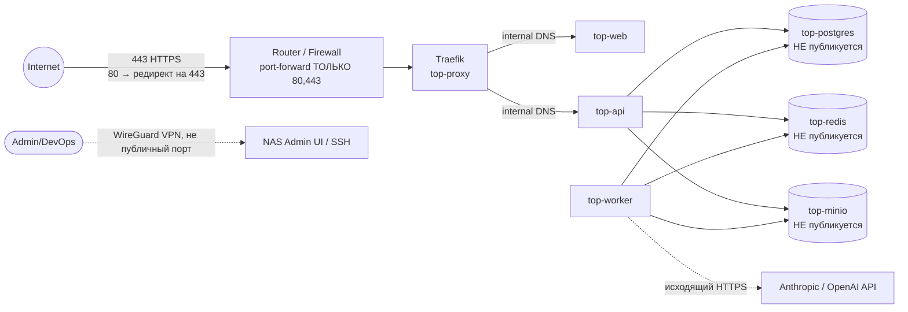

# TOP PROCUREMENT — INFRASTRUCTURE ARCHITECTURE v1 (Self-Hosted / UGREEN DXP4800 Plus)

Статус: **Locked pending confirmation** (см. Open Decisions в конце). Этот документ дополняет [ARCHITECTURE.md](ARCHITECTURE.md) — он не меняет software/domain-архитектуру (modular monolith, NestJS/Next.js/Prisma/Postgres/Redis/MinIO/AI-module уже совпадают с требованием), а фиксирует **где и как это физически работает**. Источники: `TOP Procurement.md`, `TOP Procurement — CTO Decision Lock.md`, `TOP Procurement — Infrastructure Decision Lock.md`.

Ключевой принцип, который держит вся эта архитектура: **NAS — это deployment target, не часть domain logic.** Ничто в `apps/api`, `apps/web`, `apps/worker`, `packages/*` не знает, что оно работает на UGREEN. Приложение говорит с Postgres по TCP, с Redis по TCP, с объектным хранилищем по S3 API — где физически стоит железо, для кода не имеет значения.

---

## STEP 1 — Final Infrastructure Architecture

```text
                         INTERNET
                            │
                    Router / Firewall  ── port-forward: 443 (и 80 для ACME/redirect) ТОЛЬКО
                            │
                            ▼
                 UGREEN DXP4800 Plus (bare metal)
                            │
                      Docker Engine (host OS: UGOS / встроенная Linux-система с Docker support)
                            │
              ┌─────────────┴─────────────┐
              │      docker network        │
              │        top_internal        │
              │                             │
              │  Traefik (edge, публикует   │
              │  80/443 на host)            │
              │        │                    │
              │        ▼                    │
              │  top-web (Next.js)          │
              │        │                    │
              │        ▼                    │
              │  top-api (NestJS)           │
              │    │        │        │      │
              │    ▼        ▼        ▼      │
              │ postgres  redis   minio      │
              │    ▲                         │
              │    │                         │
              │  top-worker (BullMQ)         │
              │    │                         │
              │    ▼                         │
              │  AI Orchestrator (внутри api/worker,
              │  вызывает внешний Anthropic/OpenAI API) │
              └─────────────────────────────┘
                            │
                   NAS Storage Pools
              ┌─────────────┴─────────────┐
              ▼                             ▼
      NVMe pool (2× M.2)             SATA pool (4× bay)
      → Postgres data                → MinIO (документы)
      → Redis persistence (AOF)      → Backups (local copy)
      → Docker images/containers
```

Ни один из внутренних сервисов (postgres/redis/minio/api/worker) не публикует порт на хост напрямую — единственная точка входа снаружи — Traefik на 443 (раздел STEP4).

---

## STEP 2 — Final Software Architecture

Без изменений относительно [ARCHITECTURE.md §1](ARCHITECTURE.md#1-final-architecture): **modular monolith**, `apps/web` (Next.js), `apps/api` (NestJS, модули `auth/organizations/users/suppliers/purchase-requests/rfq/quotes/comparison/recommendations/purchase-orders/notifications/documents/audit/ai` — именование модулей здесь уточнено под этот decision lock, семантически совпадает с ранее описанным), `apps/worker` (BullMQ consumer). Причина, почему это решение не меняется от того, что хост — NAS, а не cloud VM: modular monolith — это про **software boundaries**, а не про то, где физически крутится процесс. Один и тот же Docker image `top-api` запускается что на NAS, что на VPS без модификаций.

Единственное уточнение, которое вносит инфраструктурный контекст: **никакой локальной тяжёлой обработки, требующей GPU.** DXP4800 Plus — Pentium Gold 8505, 5C/6T, без GPU. Это подтверждает уже принятое ранее решение (ARCHITECTURE.md §3.2) — extraction идёт через vision-capable LLM по API (Anthropic/OpenAI), не через локальный OCR/локальную LLM. `AIProvider` интерфейс остаётся абстракцией — в будущем `OllamaProvider` можно добавить, но не как обязательную часть MVP и не как задачу, которую должен тянуть NAS без GPU.

---

## STEP 3 — Docker Architecture

### 3.1 Состав контейнеров (MVP)

| Container | Purpose | Image (база) | vCPU limit | RAM limit | Storage | Network |
|---|---|---|---:|---:|---|---|
| `top-proxy` | TLS termination, routing, авто-получение сертификатов | `traefik:v3` | 0.3 | 128 MB | conf + cert volume (NVMe) | публикует 80/443 на host |
| `top-web` | Next.js frontend (SSR) | `node:22-alpine` (multi-stage build) | 0.5 | 512 MB | — (stateless) | internal only, проксируется через `top-proxy` |
| `top-api` | NestJS REST API + AI module | `node:22-alpine` | 1.0 | 1 GB | — (stateless) | internal only |
| `top-worker` | BullMQ consumer (extraction, email, doc generation) | `node:22-alpine` | 0.7 | 768 MB | tmp scratch (NVMe) | internal only |
| `top-postgres` | Основная БД | `postgres:16-alpine` | 1.5 | 2–4 GB | NVMe pool (data volume) | internal only, порт не публикуется |
| `top-redis` | Очереди + rate-limit кэш | `redis:7-alpine` | 0.3 | 256 MB | NVMe pool (AOF persistence) | internal only |
| `top-minio` | Документы (S3-compatible) | `minio/minio` | 0.5 | 512 MB | SATA pool (bulk) | internal only |
| `top-backup` | Плановые job'ы бэкапа (cron внутри контейнера) | `alpine` + `pg_dump`/`restic`/`rclone` | 0.3 (burst) | 256 MB | SATA pool + внешняя цель | internal only, исходящий трафик наружу для offsite-копии |
| `top-status` *(опционально)* | Лёгкий uptime/healthcheck дашборд | `louislam/uptime-kuma` | 0.2 | 128 MB | small volume | internal, доступ через `top-proxy` под Basic Auth |

**Итого при штатной нагрузке:** ≈ 5.3 vCPU / ≈ 5.5–7.5 GB RAM. DXP4800 Plus даёт 5 ядер / 6 потоков — это означает, что при пиковой одновременной нагрузке (AI extraction + несколько API-запросов + backup job) возможен CPU contention. Это ожидаемо и приемлемо для MVP-пилота (один-два клиента, не тясячи RPS) — см. Open Decisions по RAM.

`top-monitoring` (Prometheus/Grafana) и `top-ocr` из шаблона Decision Lock **сознательно не включены в MVP**: Prometheus+Grafana+Loki на 5-ядерном NAS без выделенной нагрузки — это ещё +1–1.5 vCPU и +1 GB RAM ради observability, которая на этапе одного пилотного клиента даёт мало ценности относительно cost; `top-status` (Uptime Kuma) закрывает базовый "жив ли сервис" мониторинг почти бесплатно. Полный Prometheus/Grafana — Phase 2, когда появится больше tenant'ов и станет important тренды/алерты, а не просто up/down.

`top-ocr` не нужен в принципе — решение уже зафиксировано в ARCHITECTURE.md §3.2: extraction идёт через vision-LLM, отдельного OCR-движка нет.

### 3.2 docker-compose — структура (не финальный YAML, но контракт)

```yaml
networks:
  top_internal:
    driver: bridge

volumes:
  postgres_data:      # → NVMe pool
  redis_data:          # → NVMe pool
  minio_data:           # → SATA pool
  backup_data:          # → SATA pool
  traefik_certs:

services:
  proxy:      { image: traefik:v3, networks: [top_internal], ports: ["80:80", "443:443"] }
  web:        { image: top-web:${TAG}, networks: [top_internal], depends_on: [api] }
  api:        { image: top-api:${TAG}, networks: [top_internal], depends_on: [postgres, redis, minio] }
  worker:     { image: top-worker:${TAG}, networks: [top_internal], depends_on: [postgres, redis, minio] }
  postgres:   { image: postgres:16-alpine, networks: [top_internal], volumes: [postgres_data:/var/lib/postgresql/data] }
  redis:      { image: redis:7-alpine, networks: [top_internal], volumes: [redis_data:/data] }
  minio:      { image: minio/minio, networks: [top_internal], volumes: [minio_data:/data] }
  backup:     { image: top-backup:${TAG}, networks: [top_internal], volumes: [postgres_data:ro, minio_data:ro, backup_data] }
  status:     { image: louislam/uptime-kuma, networks: [top_internal] }
```

Все сервисы — на одной Docker network (`top_internal`). Требование Decision Lock ("не открывать 5432/6379/9000 наружу") закрывается тем, что у этих сервисов **вообще нет секции `ports:`** — они видны только внутри `top_internal` по service-имени. Единственный контейнер с `ports:` на host — `proxy`.

---

## STEP 4 — Network Architecture



**Правила:**

- Наружу открыты **только 80 и 443** на роутере (port-forward на NAS). 80 существует только для ACME HTTP-01 challenge и редиректа на HTTPS — никакого приложения на 80 не отвечает.
- Postgres (5432), Redis (6379), MinIO API (9000)/Console (9001) — **не публикуются ни на host, ни наружу**, доступны только внутри `top_internal` Docker-сети.
- Административный доступ к самому NAS (UGOS admin panel, SSH) — **не через публичный интернет**. Рекомендация: WireGuard VPN (UGREEN/большинство NAS поддерживают через Docker-контейнер или встроенно) для доступа к управлению NAS и Docker извне; при работе из локальной сети — прямой доступ по LAN.
- 10GbE/2.5GbE интерфейсы NAS для MVP избыточны (нагрузка на старте — единицы-десятки пользователей), но пригодятся, когда NAS станет backup/storage-узлом для будущего cloud-окружения (Phase 2 — см. STEP 14) — трафик бэкапов между cloud и NAS через VPN-туннель будет использовать этот канал.

---

## STEP 5 — Storage Architecture

### 5.1 Два storage pool с разным назначением

```text
NVMe pool (2× M.2, low-latency)
 ├─ Postgres data directory        ← самое чувствительное к latency
 ├─ Redis AOF persistence
 └─ Docker images / container layer storage

SATA pool (4× bay, bulk capacity, можно RAID)
 ├─ MinIO data (документы: КП, PO, спецификации, сканы)
 └─ Local backup copies (перед отправкой offsite)
```

Причина разделения: Postgres чувствителен к latency записи (commit fsync), MinIO — к объёму, не к latency (документы читаются/пишутся не на каждый HTTP-запрос). Смешивать их на одном pool means either переплата за NVMe под большие файлы, либо просадка БД под нагрузкой bulk-чтения документов.

### 5.2 MinIO layout — как в Decision Lock, без изменений

```text
top-documents (bucket)
 └── organizations/
      ├── org-<uuid>/
      │    ├── suppliers/
      │    ├── rfq/
      │    ├── quotes/
      │    ├── purchase-orders/
      │    └── contracts/            (Phase 2, backend уже поддерживает как AttachmentOwnerType)
      └── org-<uuid>/...
 └── system/
```

### 5.3 Уточнение схемы Attachment (сверка с этим документом)

Decision Lock (§8) требует, чтобы metadata-запись содержала явно `bucket`. В `ARCHITECTURE.md` модель `Attachment` хранила единое поле `storageKey` (с org-префиксом), без отдельного поля `bucket`, потому что предполагался один bucket на всю систему. Уточняю модель, чтобы буквально соответствовать требованию и не блокировать будущий multi-bucket сценарий (например, отдельный bucket под backups или под конкретного крупного клиента):

```prisma
model Attachment {
  id             String              @id @default(uuid())
  organizationId String
  ownerType      AttachmentOwnerType
  ownerId        String
  bucket         String              @default("top-documents")
  objectKey      String              // organizations/org-<id>/rfq/<rfqId>/<uuid>-<filename>
  fileName       String
  mimeType       String
  sizeBytes      Int
  uploadedById   String
  createdAt      DateTime            @default(now())
}
```

Это единственное изменение в database schema из-за инфраструктурного документа — сама архитектура БД (ARCHITECTURE.md §5) остаётся в силе.

### 5.4 Storage abstraction (portability)

`packages/database`/`packages/config` не содержат SDK, специфичного для MinIO — используется стандартный **S3 API client** (`@aws-sdk/client-s3`, MinIO 100% совместим). Endpoint/credentials/bucket — из ENV:

```env
S3_ENDPOINT=http://minio:9000       # на NAS
# при миграции в cloud:
# S3_ENDPOINT=https://s3.amazonaws.com  или  https://<account>.r2.cloudflarestorage.com
S3_ACCESS_KEY=
S3_SECRET_KEY=
S3_BUCKET=top-documents
S3_FORCE_PATH_STYLE=true            # true для MinIO, false для AWS S3
```

Смена MinIO на AWS S3/R2/Backblaze B2 = смена 4 переменных окружения, ноль изменений в коде.

---

## STEP 6 — Backup & Disaster Recovery

### 6.1 Принцип

**RAID ≠ Backup.** RAID на SATA pool защищает от отказа одного физического диска, но не защищает от: случайного удаления, порчи данных багом, ransomware, отказа всего NAS (пожар/скачок напряжения/кража). Поэтому обязательна независимая backup-цепочка с offsite-копией.

### 6.2 Что бэкапим и как

| Что | Метод | Периодичность | Куда | Retention |
|---|---|---|---|---|
| PostgreSQL | `pg_dump` (logical, custom format) внутри `top-backup` контейнера | Ежедневно, ночью (低нагрузка) | 1) SATA pool локально → 2) offsite target | 7 daily + 4 weekly + 3 monthly (grandfather-father-son) |
| MinIO документы | `rclone sync` / `mc mirror` (инкрементально, только изменения) | Ежедневно | SATA pool локально (другой volume) → offsite target | Синхронно с retention БД, plus MinIO versioning на bucket (защита от перезаписи/удаления) |
| Конфигурация (docker-compose, Traefik dynamic conf, Prisma migrations) | Git (уже версионируется в monorepo) + `.env.production.template` без секретов | При каждом изменении (git commit) | GitHub/GitLab (уже вне NAS — естественный offsite для конфигурации) | Вся история git |
| Secrets (`.env.production` реальные значения) | Зашифрованный архив (`age`/`gpg`) отдельно от git | При каждом изменении | Encrypted copy на SATA pool + offsite | Последние N версий |

### 6.3 Поток

```text
Production Data (Postgres + MinIO)
        │
        ▼  (nightly, top-backup container, cron внутри контейнера — не cron хоста)
Local Backup Copy (SATA pool, отдельный volume от "живых" данных MinIO)
        │
        ▼  (rclone/restic, инкрементально, зашифровано)
External/Offsite Backup Target
```

### 6.4 Disaster Recovery — цели для MVP

| Метрика | Target MVP | Комментарий |
|---|---|---|
| RPO (Recovery Point Objective) | ≤ 24 часа | Daily backup достаточен для пилотной стадии; при выходе на реальных платящих клиентов — переход на WAL-archiving/continuous backup (Phase 2, `pgBackRest`) для RPO в минутах |
| RTO (Recovery Time Objective) | ≤ 4 часа (ручное восстановление) | Приемлемо для MVP-пилота; Phase 2 — документированный/автоматизированный runbook сокращает до < 1 часа |
| Проверка бэкапа | Ежемесячный тестовый restore в staging | Backup, который никогда не восстанавливали — не backup |

### 6.5 Что требует вашего решения

Offsite-цель для бэкапа — это не чисто инженерное решение, а вопрос бюджета/логистики: (a) недорогое S3-совместимое холодное хранилище (Backblaze B2 / Wasabi — единицы $ в месяц за десятки GB, укладывается в ту же S3-abstraction, что и MinIO), или (b) физический второй диск/NAS в другом месте (офис/дом), который синхронизируется по расписанию. Технически поддерживаю оба варианта одинаково (просто другой `rclone remote`) — нужно от вас: какой вариант удобнее организационно (см. Open Decisions).

---

## STEP 7 — Security Architecture

Большая часть уже зафиксирована в ARCHITECTURE.md (JWT+refresh, Argon2id, RBAC, tenant isolation на 6 уровнях, audit log immutable). Здесь — то, что специфично именно для self-hosted развёртывания на NAS:

| Слой | Мера |
|---|---|
| Периметр | Только 80/443 port-forward на роутере; всё остальное — внутри домашней/офисной сети или за VPN |
| TLS | Traefik + автоматический Let's Encrypt (HTTP-01 или DNS-01 challenge — зависит от того, статический ли внешний IP/есть ли доступ к API DNS-провайдера, см. Open Decisions) |
| Docker network isolation | Все backend-сервисы на изолированной bridge-сети без публикации портов (STEP3/STEP4) |
| Admin-доступ к NAS | WireGuard VPN вместо публичного admin UI/SSH; смена дефолтных учётных данных UGOS обязательна перед go-live |
| Secrets | `.env.production` — вне git, права доступа 600, зашифрованная резервная копия (STEP6); в Phase 2 — переход на настоящий secrets manager (Vault/Infisical self-hosted), если команда/число интеграций вырастет |
| File upload | MIME-валидация + ограничение размера + расширений на уровне `top-api` до отправки в MinIO; сканирование на вирусы — рекомендую `ClamAV` как отдельный lightweight-шаг в pipeline загрузки документов уже в MVP (риск: пилотный клиент загружает заражённый файл поставщика) — недорого по ресурсам (~200MB RAM), стоит включить сразу, а не откладывать |
| Rate limiting | На уровне Traefik middleware (простая защита от brute-force на `/auth/login` и `/portal/*`) + на уровне NestJS guard для чувствительных write-эндпоинтов |
| Backup encryption | Офсайт-копия — обязательно зашифрована (see STEP6) — сервер физически в помещении компании, но офсайт-копия по умолчанию должна считаться менее доверенной средой |
| CORS | `top-api` разрешает только домены из `ALLOWED_ORIGINS` env (web app + supplier portal домен, если разнесены) |

**Единственное отличие от "стандартного" cloud security чеклиста:** физическая безопасность (кто имеет физический доступ к NAS) становится частью модели угроз — это вне зоны ответственности приложения, но стоит зафиксировать организационно (NAS в серверной/закрытом помещении, не в общедоступном офисном пространстве).

---

## STEP 8 — Monorepo Structure

Обновлено под требование Decision Lock — добавлены `infrastructure/` и `docs/`:

```text
top-procurement/
├── apps/
│   ├── web/
│   ├── api/
│   └── worker/
├── packages/
│   ├── ui/
│   ├── database/
│   ├── types/
│   ├── validation/
│   ├── config/
│   └── ai/
├── infrastructure/
│   ├── docker/
│   │   ├── web.Dockerfile
│   │   ├── api.Dockerfile
│   │   └── worker.Dockerfile
│   ├── traefik/
│   │   ├── traefik.yml              # static config
│   │   └── dynamic/                 # middlewares: rate-limit, basic-auth для top-status
│   └── backup/
│       ├── backup.sh                 # pg_dump + rclone/restic
│       └── restore.sh                # документированный restore-путь (используется в ежемесячном тесте)
├── docs/
│   ├── ARCHITECTURE.md               (ссылка/копия корневого — или переносим оба .md сюда, на ваше усмотрение)
│   └── INFRASTRUCTURE.md
├── docker-compose.yml                 # development (упрощённый, без Traefik/TLS)
├── docker-compose.production.yml      # production (Traefik, resource limits, restart policies)
├── .env.development.example
├── .env.staging.example
├── .env.production.example            # шаблон, БЕЗ реальных secrets
├── turbo.json
├── pnpm-workspace.yaml
└── package.json
```

---

## STEP 9 — Database / ERD

Без изменений по существу — полная схема, ERD и обоснование в [ARCHITECTURE.md §4–5](ARCHITECTURE.md#4-erd). Единственная правка от этого документа — поле `bucket` в модели `Attachment` (см. STEP 5.3 выше). Тюнинг Postgres под ресурсы NAS (не архитектурное решение, операционный параметр, настраивается в `postgresql.conf`/env при деплое):

```text
shared_buffers = ~25% выделенной RAM контейнера (например 512MB–1GB при лимите 2–4GB)
max_connections = 50–100 (для NestJS с connection pool через Prisma этого достаточно на MVP-нагрузке)
work_mem = умеренный (4–16MB) — избегаем OOM при параллельных сравнениях/агрегациях на ограниченной RAM
```

---

## STEP 10 — MVP API

Без изменений — полный список эндпоинтов в [ARCHITECTURE.md §7](ARCHITECTURE.md#7-api-specification). Инфраструктурное уточнение: `api.<domain>` и `app.<domain>` — оба маршрутизируются через один и тот же `top-proxy` (Traefik), просто разные `Host()`-правила в labels контейнеров `top-web`/`top-api`. Supplier Portal (`/portal/*`) физически — те же контейнеры `top-web`+`top-api`, отдельного поддомена не требует (но может получить его в Phase 2, если понадобится визуально/юридически разделить "внутреннюю" систему и публичный портал поставщика).

---

## STEP 11 — MVP Screen Map

Без изменений — [ARCHITECTURE.md §8](ARCHITECTURE.md#8-frontend-screen-map).

---

## STEP 12 — Development Roadmap

Расширяю Milestone M0 из ARCHITECTURE.md §11 инфраструктурными задачами (они должны быть готовы до того, как на NAS попадёт что-то, кроме `docker compose up` в dev-режиме):

| # | Milestone | Содержание | Критерий готовности |
|---|---|---|---|
| M0a | **NAS bootstrap** | Установка/обновление UGOS, включение Docker Engine, настройка storage pools (NVMe → Postgres/Redis, SATA → MinIO/backup), WireGuard VPN для admin-доступа, смена дефолтных паролей NAS | С NAS можно управлять только через VPN, Docker Engine работает, pools созданы |
| M0b | **Repo + local dev** | pnpm+Turborepo скелет, `docker-compose.yml` (dev), Prisma init + миграция (включая обновлённый `Attachment.bucket`) | `docker compose up` локально поднимает web/api/worker/postgres/redis/minio |
| M0c | **Network & domain** | Домен куплен/делегирован, DNS A-запись → внешний IP NAS (или DDNS, если IP динамический), `docker-compose.production.yml` с Traefik, ACME-конфигурация проверена (staging Let's Encrypt сначала, чтобы не упереться в rate limit) | `https://app.<domain>` отдаёт валидный сертификат |
| M0d | **Backup pipeline** | `top-backup` контейнер, `backup.sh`/`restore.sh`, offsite target подключён, первый ручной restore протестирован | Тестовый restore из backup проходит успешно до появления реальных production-данных |
| M1–M8 | *(без изменений)* | Auth+RBAC → Purchase Request → Suppliers/RFQ/Portal → AI Extraction → Comparison → Recommendation+Approval → PO → Dashboard/Hardening | См. [ARCHITECTURE.md §11](ARCHITECTURE.md#11-development-milestones) |
| M9 | **Go-live gate** | Security review (chеклист STEP7), нагрузочная проверка на реальном железе (не dev-машине), backup+restore rehearsal, мониторинг (top-status) активен | Пилотный клиент может начать использовать production на NAS |

---

## STEP 13 — Migration Path NAS → Cloud (Phase 2+)

```text
UGREEN DXP4800 Plus (production)
        │  когда: рост нагрузки/tenant'ов требует больше CPU/RAM/uptime SLA, чем NAS может дать
        ▼
VPS (например, managed Postgres + managed Redis + тот же Docker-стек на VPS)
        │  когда: нужен multi-region/более строгий SLA/managed-сервисы (авто-failover БД и т.п.)
        ▼
Cloud (AWS/GCP/Azure/подобный) — managed Postgres (RDS-подобный), managed Redis, S3, оркестрация (ECS/Cloud Run/K8s если реально оправдано объёмом)
        │
        ▼
UGREEN DXP4800 Plus → переходит в роль backup/DR/document-archive узла (см. Decision Lock §1.6):
  - offsite-копия production backup (теперь "offsite" относительно cloud)
  - холодный архив старых документов
  - disaster recovery restore target
```

**Что гарантирует нулевые изменения кода при переходе:** тот же список, что и раньше в ARCHITECTURE.md — переменные окружения (`DATABASE_URL`, `REDIS_URL`, `S3_*`), storage abstraction (S3 API), stateless `web`/`api`/`worker` контейнеры (вся persistence — в Postgres/Redis/MinIO, не в файловой системе контейнера). Единственное, что меняется при миграции — `docker-compose.production.yml`/deployment target и значения ENV, не исходный код приложения.

---

## STEP (доп.) — Estimated Resource Consumption (сводная таблица)

| Service | Purpose | Image | CPU | RAM | Storage | Network | Dependencies | Backup | Security |
|---|---|---|---:|---:|---|---|---|---|---|
| top-proxy | TLS + routing | traefik:v3 | 0.3 | 128MB | certs (NVMe, малый) | 80/443 публично | — | конфиг в git | ACME, rate-limit middleware |
| top-web | Frontend SSR | node:22-alpine | 0.5 | 512MB | stateless | internal | top-api | не требуется (stateless) | CSP headers, secure cookies |
| top-api | Backend API + AI orchestration | node:22-alpine | 1.0 | 1GB | stateless | internal | postgres, redis, minio | не требуется (stateless) | JWT/RBAC/tenant guards, input validation |
| top-worker | Async jobs | node:22-alpine | 0.7 | 768MB | tmp scratch (NVMe) | internal + исходящий к LLM API | postgres, redis, minio | не требуется (stateless) | те же guards, что и api (переиспользует packages) |
| top-postgres | Данные | postgres:16-alpine | 1.5 | 2–4GB | NVMe, растёт с данными | internal only | — | ежедневный pg_dump + offsite | не публикуется наружу, пароль из secrets |
| top-redis | Очереди/кэш | redis:7-alpine | 0.3 | 256MB | NVMe, AOF | internal only | — | не критично (можно восстановить из БД-состояния, очереди — transient) | не публикуется наружу |
| top-minio | Документы | minio/minio | 0.5 | 512MB | SATA, растёт с документами | internal only | — | rclone sync + offsite, bucket versioning | не публикуется наружу, presigned URL с TTL |
| top-backup | Backup orchestration | alpine+restic/rclone | 0.3 (burst) | 256MB | SATA (local copy) | исходящий к offsite target | postgres, minio | сам является backup-слоем | encrypted at offsite |
| top-status | Health/uptime | uptime-kuma | 0.2 | 128MB | малый volume | internal, доступ через proxy | все сервисы (пингует) | не критично | Basic Auth за Traefik |
| **Итого (типовая нагрузка)** | | | **~5.3 vCPU** | **~5.5–7.5 GB** | NVMe: десятки GB / SATA: сотни GB–TB (растёт с документами) | | | | |

DXP4800 Plus: 5 ядер/6 потоков, RAM до 64GB. При базовой конфигурации NAS (часто это 8GB на старте) суммарный лимит контейнеров (5.5–7.5GB) оставляет мало запаса для хост-ОС и файловых сервисов NAS одновременно — рекомендация ниже.

---

## Open Decisions — требуют вашего решения (факты/бюджет, не инженерный выбор)

Это не "инженерные" развилки (там я решил сам и объяснил почему — Traefik вместо Nginx, без Prometheus/Grafana в MVP, без top-ocr, single flat Docker network), а вещи, которые зависят от физических/организационных фактов, которые мне не известны:

1. **Сколько RAM реально установлено на вашем DXP4800 Plus сейчас?** Расчёт выше (~5.5–7.5GB под контейнеры) комфортно помещается только если установлено от 16GB, с запасом — от 32GB (учитывая, что NAS сам по себе использует RAM под файловые сервисы/UGOS). Если сейчас стоит база (часто 8GB) — рекомендую апгрейд до 32GB перед production go-live (DDR5, слоты уже поддерживают до 64GB согласно спецификации).
2. **Offsite backup destination** (STEP 6.5) — недорогое S3-совместимое холодное хранилище (Backblaze B2/Wasabi, ~$/мес за GB) или второй физический носитель/NAS в другой локации? Оба технически поддерживаются одинаково просто, разница — в деньгах и логистике, это ваш выбор.
3. **Домен и DNS-провайдер.** Нужен реальный домен (например `*.uz` или международный) и доступ к его DNS — это влияет на способ получения TLS-сертификата (HTTP-01 challenge, если просто port-forward 80, или DNS-01, если хотите wildcard-сертификат и у DNS-провайдера есть API).
4. **Статический внешний IP или динамический?** Если провайдер интернета не даёт статический IP, нужен DDNS-клиент (многие NAS, включая UGREEN, имеют встроенную поддержку) — небольшая, но обязательная деталь network-конфигурации.
5. **Anthropic/OpenAI API ключ и бюджет** — уже поднималось в ARCHITECTURE.md Open Decisions, здесь это дополнительно означает, что `top-worker` должен иметь исходящий доступ в интернет к API провайдера (это стандартный исходящий HTTPS, firewall обычно не блокирует исходящие по умолчанию, но стоит явно подтвердить, что на роутере нет ограничений исходящего трафика).

Как только по этим пяти пунктам будет ответ — можно переходить к M0a (NAS bootstrap) и M0b (repo scaffold), это первый код/конфигурация, которые реально появятся в репозитории. До этого, как и просит документ, дальше не иду.
