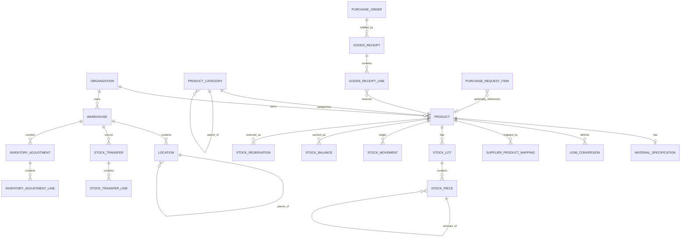

# M2 — PRODUCT MASTER + MATERIAL & STOCK — ARCHITECTURE PROPOSAL (PHASE A)

Статус: **PHASE A — ожидает approval.** Код не писался, миграции не применялись, production не менялся. Baseline: commit `55e4192` (main, gitea/main, чистое дерево на момент начала проектирования).

Этот документ — единственный источник истины для старта PHASE B (implementation). Следует тому же формату, что `ARCHITECTURE.md` (M0) и `FINAL-INFRASTRUCTURE-ARCHITECTURE.md` (M0 infra addendum).

---

## 1. M2 Executive Summary

M2 создаёт фундамент **Product Master + Material & Stock** поверх существующей инфраструктуры M0/M1. Основная цепочка, которую нужно поддержать:

```text
Product → Material Specification → Multi-UOM → Warehouse/Location
   → Receiving (partial, factual) → Stock Ledger (Lot/Piece)
   → Reservation → Issue → Cut/Remnant → Inventory Adjustment → Transfer
```

Ключевая инженерная проблема — не «Product + quantity», а поддержка промышленных материалов, которые делятся на физические куски с разным фактическим остатком (медная шина: 12 pcs × 6 m заказано, но на складе реально лежат куски 6.00/5.80/4.35/2.70 m, и после выдачи 4.00 m из куска 4.35 m остаток 0.35 m должен стать новым складским остатком, не исчезнуть).

M2 не трогает M0/M1: ни одна существующая таблица не переименовывается, не удаляется; единственное изменение существующей модели — одно nullable-поле `PurchaseRequestItem.productId`, которое уже было явно предусмотрено как extension point в текущей схеме (см. §3). Tenant isolation, RBAC (enum, 6 ролей), auth — не меняются.

**Объём:** 18 новых таблиц, 9 новых enum'ов, 1 расширение существующей таблицы (nullable FK). Ничего не удалено, ничего не переименовано.

---

## 2. Current Architecture Findings (Repository Audit)

Проверено напрямую в репозитории (не предполагалось, а прочитано):

- **Git:** HEAD = `55e4192`, ветка `main`, синхронизирована с `gitea/main`, working tree чистый.
- **Prisma schema** (`packages/database/prisma/schema.prisma`, 676 строк): содержит полную M0-модель (Organization/User/Department/Category/Supplier/PurchaseRequest/RFQ/Quote/AIExtraction/Recommendation/ApprovalRule/ApprovalInstance/PurchaseOrder/TaxRule/ExchangeRate/Attachment/Notification/AuditLog) + M1-модель (RefreshToken/Invitation). **Важно: `PurchaseOrder`/`PurchaseOrderItem`/`Supplier` таблицы уже существуют** (созданы миграцией `20260913235443_init`), но НЕ имеют backing NestJS-модуля/контроллера — они «мёртвые» данные схемы до сих пор. M2 может безопасно ссылаться на них по FK уже сейчас.
- **Уже заложенный extension point:** `PurchaseRequestItem` (schema.prisma:338) содержит буквальный комментарий: *«Phase 2 extension point... productId String? — nullable FK to a future Product model, additive migration, no backfill required»*. Это прямое подтверждение архитектурного намерения, не моя интерпретация.
- **Tenant isolation** (`packages/database/src/client.ts`): Prisma Client Extension, `DIRECT_TENANT_MODELS` — set моделей, у которых `organizationId` инжектится автоматически. Модели вне set («child» — `PurchaseRequestItem`, `RFQItem`, `QuoteItem`, `AIExtraction`, `SupplierContact` и т.д.) не имеют своего `organizationId`, достигаются только через уже tenant-проверенного родителя. Это осознанный, задокументированный паттерн — M2 обязан следовать ему, не изобретать свой.
- **RBAC:** `UserRole` enum, 6 значений, `RolesGuard` — `@Roles()` decorator (пусто = любой authenticated), fail-closed через `ForbiddenException`. Никаких Role/Permission таблиц.
- **Auth/Guards pipeline:** `JwtAuthGuard → TenantGuard → RolesGuard` (APP_GUARD, по порядку) + `TenantContextInterceptor` (APP_INTERCEPTOR, реально прокидывает AsyncLocalStorage-контекст).
- **DB access:** `TENANT_PRISMA`/`SYSTEM_PRISMA` DI-токены (`database.module.ts`). `SYSTEM_PRISMA` — только для pre-auth потоков (login/register/invitation-lookup). M2 не имеет pre-auth сценариев → всегда `TENANT_PRISMA`.
- **Audit:** `AuditService.log()` пишет в `AuditLog` через `SYSTEM_PRISMA` (organizationId передаётся явно вызывающим кодом). На уровне БД `app_user` роли не имеет `DELETE`/`UPDATE` grant на `audit_log` (ARCHITECTURE.md §5, «Примечание по неизменяемости»). **M2 обязан применить тот же grant-паттерн к `stock_movements`** (immutable ledger — требование §22) — см. §41.
- **Модульная структура apps/api:** НЕ `src/modules/*` (как в исходном ARCHITECTURE.md §10), а плоская: `src/auth/`, `src/organizations/`, `src/members/`, `src/health/`, `src/database/`, `src/common/`. Фактическая конвенция M1, не аспирационная из ARCHITECTURE.md. M2 следует фактической структуре.
- **Контроллер/сервис конвенция:** `@Controller("api/v1/<resource>")`, `@CurrentUser() user: AccessTokenClaims`, `@Roles("ADMIN")`, `@Body(new ZodValidationPipe(schema))`, сервис принимает `organizationId` первым параметром явно (не полагается только на AsyncLocalStorage), плюс `TENANT_PRISMA` автоматически скоупит запросы.
- **Zod-конвенция:** схемы в `packages/validation/src/<domain>.ts`, экспорт `type X = z.infer<typeof xSchema>`, enum-значения дублируются как `as const` массив (не импортируются из `@top/database`, чтобы не тащить Prisma client в браузерный бандл). `packages/types/src/index.ts` — тот же дублирующий паттерн для enum'ов и response-shape интерфейсов.
- **Decimal-конвенция:** ВСЕ количества в существующей схеме — `Decimal @db.Decimal(18, 3)` (PurchaseRequestItem.quantity, RFQItem.quantity, QuoteItem.quantity, PurchaseOrderItem.quantity — единообразно). Деньги — `Decimal(18,2)`/`Decimal(18,4)` (unit price). Курсы — `Decimal(18,6)` (ExchangeRate.rate). **M2 обязан использовать те же точности**, не изобретать новую схему precision «по UOM».
- **Frontend routing (фактическое, не аспирационное):** плоские маршруты `/dashboard`, `/login`, `/register`, `/settings/organization`, `/settings/members`, `/invite/[token]` — без route groups `(internal)`/`(portal)`, вопреки исходному ARCHITECTURE.md §8. M2 следует фактической плоской структуре.
- **AI-пакет:** `packages/ai/src/{provider.interface.ts, ocr-provider.interface.ts}` — интерфейсы существуют, реализаций нет (ожидаемо, AI-функции не в scope M2 согласно самому M2-промпту §56).
- **Docker/deploy:** `docker-compose.yml` + `.prod.yml`/`.staging.yml` overlay, MinIO уже поднят как сервис (`minio`, healthcheck на `9000/minio/health/live`), `Attachment.bucket`/`objectKey` поля уже в схеме — то есть объектное хранилище инфраструктурно готово, если M2 когда-нибудь начнёт хранить сертификаты/datasheets материалов (см. §57, не делается в M2 core).
- **M1.1 lessons, применяются к M2 deployment (§70 требование):** (1) всегда деплоить с полным `-f docker-compose.yml -f docker-compose.prod.yml`, никогда base-only; (2) проверять Traefik-роутинг реальным запросом с `Host:`-заголовком до, а не после релиза; (3) JWT/cookie-конфигурация не трогается M2 — не относится, но паттерн «verify live, не только читать код» переносится на все M2 concurrency/lock-тесты.

**Отсутствующие файлы:** `apps/worker` не содержит processors/ (только `queues.ts`, `redis.ts`, `main.ts`, `healthcheck.ts`) — очередей для конкретных задач (extraction, email) ещё нет, ожидаемо (M4+ по исходному плану, вне scope M2). Явно фиксирую как факт, не выдумываю.

---

## 3. Existing Schema Impact

**Изменяется ровно одна существующая модель, аддитивно, без backfill:**

```prisma
model PurchaseRequestItem {
  // ...существующие поля не трогаются...
  productId String?
  product   Product? @relation(fields: [productId], references: [id])
}
```

Это буквально то, что уже описано как «Phase 2 extension point» в текущем `schema.prisma` (строка 338) и в `FINAL-INFRASTRUCTURE-ARCHITECTURE.md` («Product Master extensibility», п.6). Не изобретение — реализация уже согласованного плана.

**Ничего не удаляется, не переименовывается.** `AttachmentOwnerType` расширение (`PRODUCT`, `GOODS_RECEIPT` значения) — **отложено**, не входит в M2 core (см. §57, OD в §61).

**Используется по FK, не модифицируется:** `Organization`, `User`, `Supplier`, `PurchaseOrder`, `PurchaseOrderItem`.

---

## 4. Domain Model

```text
Organization (существующий tenant root)
 ├─ ProductCategory (новое, дерево, parentId)
 ├─ Product (новое)
 │   ├─ MaterialSpecification (новое, 1:1, опционально)
 │   ├─ UomConversion[] (новое, product-scoped, кросс-размерность)
 │   └─ SupplierProductMapping[] (новое)
 ├─ Warehouse (новое)
 │   └─ Location[] (новое, дерево, опционально)
 ├─ StockLot (новое) ── StockPiece[] (новое, опционально для PIECE-tracked)
 ├─ StockMovement (новое, immutable ledger)
 ├─ StockBalance (новое, кэш on-hand/reserved на пару product×warehouse)
 ├─ StockReservation (новое, отдельно от ledger — см. §55 п.3)
 ├─ GoodsReceipt (новое) ── GoodsReceiptLine[] (новое, child, → PurchaseOrder/Item)
 ├─ StockTransfer (новое) ── StockTransferLine[] (новое, child)
 ├─ InventoryAdjustment (новое) ── InventoryAdjustmentLine[] (новое, child)
 └─ ExternalSystemReference (новое, generic SAP-readiness mapping)
```

**Product identity (§30/§31 duplicate-product problem):** идентичность товара — `organizationId + sku` (org-unique, обязательное, авто-генерируется если не задано пользователем явно). Человеко-читаемое имя НИКОГДА не участвует в определении идентичности — «Copper Busbar 50x5» и «Медная шина 50х5» с разными SKU — два разных Product с точки зрения БД, и это осознанное MVP-решение: жёсткая защита от дублей работает только через SKU-уникальность; смысловой дедуп по имени/специфике («это, вероятно, один и тот же товар») — явно AI-функция Phase 2/3 (см. §56 исходного промпта: «находить дубликаты» — future). Для MVP снижение риска дублей — через хороший search-before-create UX (фильтр по категории+спецификации), не через алгоритмическую дедупликацию.

---

## 5-17. Ключевые проектные решения (сжато; полная Prisma-схема — §24)

### 5. Product Master

`Product`: `sku` (обязательный, org-unique), `name`, `description?`, `productType` (enum, см. §8), `categoryId?` (→ ProductCategory), `brand?`, `manufacturer?`, `active` (Boolean, не enum-статус — см. обоснование ниже), `baseUomCode` (enum UomCode, обязательный), `trackingMode` (enum: QUANTITY/LOT/PIECE — определяет, как именно ведётся складской учёт этого товара), `stockTracked` (Boolean, `false` только для SERVICE), `weightNetKg?`/`weightGrossKg?`, `barcode?`, `createdById`, timestamps.

Поля, которые **намеренно не добавлены** в Product (нет domain justification в рамках M2): supplier-specific SKU (это `SupplierProductMapping`, не поле Product — иначе он не переиспользуем для мультисорсинга), legacy SAP-код (это `ExternalSystemReference`, generic-механизм, не поле Product — см. §58), «procurement settings»/«stock settings» из исходного промпта §7 как отдельные под-объекты — избыточно для MVP, `trackingMode` + `stockTracked` уже несут эту семантику.

**active: Boolean, не ProductStatus enum.** Обоснование: весь остальной кодекс (`Organization.active`, `Supplier.active`, `Category.active`, `TaxRule.active`) уже использует `Boolean active` для soft-disable — введение отдельного enum именно для Product нарушило бы единообразие без реальной необходимости (§36 просит «deactivate/archive» — булево полностью покрывает этот сценарий).

### 6. Material Specification — typed + JSONB гибрид (сравнение вариантов)

| Вариант | Плюсы | Минусы |
|---|---|---|
| Полностью typed columns (десятки nullable-полей) | Индексируемость, filtering из коробки | «Сотни nullable columns», негибко для новых типов материалов |
| Чистый JSONB | Максимальная гибкость | Невозможна эффективная индексация/фильтрация/агрегация для отчётности и будущей SAP-интеграции |
| **Гибрид (выбран)** | Индексация/фильтрация для 6 самых частых размеров + JSONB escape hatch для всего остального | Требует дисциплины: что «достаточно частое», чтобы стать typed-полем |

`MaterialSpecification` (1:1 к Product, child-паттерн, без своего `organizationId` — как `AIExtraction` у Quote): `materialName?`, `grade?`, typed `widthMm/thicknessMm/lengthMm/diameterMm/heightMm Decimal(10,3)?`, `crossSectionMm2 Decimal(12,4)?`, `attributes Json?` (всё остальное), `displayValue String?` (денормализованная human-readable строка «50 × 5 mm», пересчитывается при сохранении — прямое решение требования §14 «допускается human-readable display value, но не хранить ТОЛЬКО строкой»).

### 7-10. Multi-UOM и Conversion — ключевое архитектурное решение (OD-03, требует вашего подтверждения)

**Решение: фиксированный Prisma enum `UomCode`, БЕЗ отдельной таблицы `UnitOfMeasure`.**

```prisma
enum UomCode { PCS KG G TON M CM MM M2 M3 L ML }
```

Обоснование: §10 прямо разрешает «не обязательно все реализовывать физически, если это не нужно» — сам список единиц зафиксирован (11 значений), кастомные tenant-specific единицы не запрошены ни одним конкретным сценарием M2. Табличная реализация добавила бы реальную архитектурную проблему: `UnitOfMeasure.organizationId` должен быть nullable (NULL = global «kg»/«m», не-NULL = tenant custom) — но существующий tenant-isolation механизм (`DIRECT_TENANT_MODELS`, `client.ts`) **не умеет** обрабатывать «иногда глобальная, иногда tenant» модель — он либо всегда инжектит `organizationId` в `where`, либо не трогает модель вообще. Городить исключение под один этот случай — риск, которого только что коснулся M1.1-аудит (усложнение security-критичного механизма). Enum полностью снимает проблему.

**Conversion — разделение по типу (прямая реализация критического правила §11):**

- **Same-dimension** (M↔CM↔MM, KG↔G↔TON, M3↔L↔ML) — это точная физическая математика (SI), не требует «подтверждения», не хранится в БД. Реализуется как константный lookup в коде (`packages/validation` или `packages/database`), тестируется юнит-тестами на конкретные комбинации.
- **Cross-dimension** (KG↔M, KG↔PCS, M↔PCS) — **обязательно** таблица `UomConversion`, всегда `productId`-scoped (не nullable — глобальных кросс-размерных конверсий не существует по физике), с `source` enum (`CONFIGURED`/`MEASURED`/`NOT_AVAILABLE`) и `ratio Decimal(18,6)?` (`null` при `NOT_AVAILABLE`). Ни один сервис не имеет права use-кейса «вычислить kg→m по формуле» — только читать уже подтверждённый коэффициент, либо отказать операции, если конверсии нет.

Это прямо реализует требование §11: «НИКОГДА не используй приблизительную математическую формулу для автоматического пересчёта промышленного материала без подтверждённого коэффициента».

### 11. Warehouse / Location

`Warehouse`: `code`, `name`, `active` (Boolean), `address?`, `responsiblePersonId?` (→ User). `@@unique([organizationId, code])`.

`Location`: generic self-referencing дерево (`parentId?`), `code`, `name`, `path?` (денормализованная строка для быстрого отображения, не для запросов). **`locationId` везде nullable** на Stock-моделях — склад может работать на уровне Warehouse без детализации до полки, дерево доступно, но не обязательно для пилота (баланс простоты MVP и промышленной пригодности, как и требует §6/§20).

### 12-17. Lot / Piece / Cut / Remnant — ключевое решение (OD-04)

**Две сущности, не три: `StockLot` + `StockPiece`.** `StockSegment` как третья сущность избыточна — «segment» это и есть piece после cut-операции.

- `StockLot` — партия (supplier lot, internal lot number, quality status, manufacture/expiry date — nullable, архитектурно доступно, не обязательно). Для `trackingMode=QUANTITY` товаров (обычные goods) лот создаётся прозрачно «один лот на приход», без UI-сложности.
- `StockPiece` — физическая единица (для `trackingMode=PIECE`), принадлежит лоту, имеет `quantity`+`uomCode`, `status` (AVAILABLE/RESERVED/CONSUMED/SCRAPPED), и **`parentPieceId`** (self-relation) — ключевой механизм remnant-traceability.

**Модель cut-операции (прямое решение сценария §16-17 «медная шина»):**

Кусок 4.35 m, выдаётся 4.00 m → создаётся **одна** новая `StockPiece` (remnant, `quantity=0.35`, `parentPieceId=<исходный кусок>`, `status=AVAILABLE`), исходный кусок помечается `status=CONSUMED`. Выданные 4.00 m **не становятся отдельным StockPiece** (они покинули склад) — они существуют только как `StockMovement(ISSUE, quantity=4.00, stockPieceId=<исходный>)`. Это даёт полную traceability (`parentPieceId`-цепочка + движения) без раздувания модели третьей сущностью, и прямо удовлетворяет §17 («остаток не должен исчезать, становится новым складским остатком»).

### 18-22. Stock Model, Movements, Ledger — прямое решение требования §21 «не смешивать movement и reservation»

**`StockMovement`** — immutable ledger, только события, реально меняющие on-hand: `RECEIPT, ISSUE, TRANSFER_OUT, TRANSFER_IN, ADJUSTMENT_INCREASE, ADJUSTMENT_DECREASE, RETURN_IN, RETURN_OUT, SCRAP, CONSUMPTION`. Количество всегда положительное (направление — через `movementType`, не через знак — устраняет целый класс sign-convention багов).

**`StockReservation`** — **отдельная таблица**, НЕ строка в ledger (реализует явное требование §21: «reservation — НЕ stock movement»). Жизненный цикл: `ACTIVE → RELEASED | FULFILLED | CANCELLED`. `sourceType` enum (`PURCHASE_REQUEST | INTERNAL_REQUEST | MANUAL`) — **намеренно без `PRODUCTION_ORDER`**, так как Production Order вне scope M2; поле сделано расширяемым enum'ом, не hardcoded строкой, поэтому добавление значения в будущем — аддитивная миграция без изменения структуры (реализует требование §25 «future-compatible model, не полноценный production module»).

**`StockBalance`** — кэш on-hand/reserved на пару (product, warehouse), поддерживается транзакционно **в той же транзакции**, что и запись в ledger (см. §37 Concurrency). Ledger — источник истины; баланс — производный, восстанавливаемый replay'ем ledger (решение OD-08, обоснование в §52 — на 1M+ движений full-scan ledger на каждый read неприемлем).

### 23-24. Receiving

`GoodsReceipt` (`DRAFT → POSTED`, immutable после POSTED) + `GoodsReceiptLine` (child). `purchaseOrderId?` — **nullable FK на уже существующую** (с M0) таблицу `PurchaseOrder`/`PurchaseOrderItem`. Приёмка может существовать без PO (ad-hoc/opening balance) — реалистично для пилота, где Purchase Order module ещё не реализован как API. `receivedQuantity` — всегда отдельное явное поле от `orderedQuantity`, никогда не приравнивается автоматически (прямая реализация §24). Partial receipt — множественные `GoodsReceipt` на один PO, «остаток к получению» — вычисляемое значение (SUM ordered − SUM received), не хранится (избегает рассинхронизации).

### 25. Reservation — см. §18-22 выше.

### 26-27. Inventory Adjustment / Transfer

`InventoryAdjustment`: `systemQuantity`/`physicalQuantity`/`differenceQuantity` (последнее — хранится явно для audit-прозрачности, хотя выводимо). Опциональный `approvedById` (простое единичное поле, не полноценный `ApprovalInstance` — переиспользование существующего approval-движка было бы избыточно для M2, это Phase 2 при появлении реального запроса).

`StockTransfer` — **атомарный, не двухфазный** (OD-10). Обоснование: `IN_TRANSIT` статус оставлен в enum как будущая точка расширения, но M2 реализует только `DRAFT → COMPLETED` в одной транзакции (TRANSFER_OUT + TRANSFER_IN одновременно) — нет отдельного транспортного модуля в scope, а «наполовину завершённый transfer» — целый класс багов, которого атомарность полностью избегает.

---

## 18. Tenant Isolation Model

Следует **точно** существующему паттерну (`client.ts`), без исключений и без изменения самого механизма:

**Добавляются в `DIRECT_TENANT_MODELS`** (primary aggregates, свой `organizationId`, авто-инжект): `Product`, `ProductCategory`, `Warehouse`, `Location`, `StockLot`, `StockPiece`, `StockMovement`, `StockReservation`, `StockBalance`, `GoodsReceipt`, `StockTransfer`, `InventoryAdjustment`, `SupplierProductMapping`, `ExternalSystemReference`, `UomConversion`.

**НЕ добавляются** (child-модели, без своего `organizationId`, достигаются только через tenant-проверенного родителя — ровно так же, как `PurchaseRequestItem`/`RFQItem`/`AIExtraction` сегодня): `MaterialSpecification` (через Product), `GoodsReceiptLine` (через GoodsReceipt), `StockTransferLine` (через StockTransfer), `InventoryAdjustmentLine` (через InventoryAdjustment).

**UomCode — не таблица, не требует tenant-scoping вообще** (см. §7-10) — снимает целый класс «global vs tenant» вопросов из §60/OD-07.

---

## 19. RBAC Matrix (OD-12 — требует подтверждения: разрешение конфликта в самом M2-промпте)

Промпт §43 приводит пример-список ролей (`ADMIN/PROCUREMENT/WAREHOUSE/MANAGER/VIEWER`), которого не существует в locked-архитектуре, и в этом же разделе требует «не придумывай новые роли без необходимости». Согласно §2.2 (locked architecture) и приоритету «следовать зафиксированной архитектуре», M2 использует **только существующие 6 значений `UserRole`**, без новых ролей:

| Действие | ADMIN | PROCUREMENT_MANAGER | PROCUREMENT_SPECIALIST | APPROVER | EMPLOYEE | SUPPLIER |
|---|:---:|:---:|:---:|:---:|:---:|:---:|
| Просмотр каталога Product / остатков | ✓ | ✓ | ✓ | ✓ | ✓ (read-only) | – |
| CRUD Product / MaterialSpecification / Category | ✓ | ✓ | ✓ (create/edit, без архивации) | – | – | – |
| Управление UomConversion (подтверждение коэффициента) | ✓ | ✓ | – | – | – | – |
| CRUD Warehouse / Location | ✓ | ✓ | – | – | – | – |
| Receiving (создание/POST GoodsReceipt) | ✓ | ✓ | ✓ | – | – | – |
| Issue / Reservation (создание) | ✓ | ✓ | ✓ | – | – | – |
| Stock Transfer | ✓ | ✓ | ✓ | – | – | – |
| Inventory Adjustment — создание (DRAFT) | ✓ | ✓ | ✓ | – | – | – |
| Inventory Adjustment — approve/POST | ✓ | ✓ | – | – | – | – |
| SupplierProductMapping / ExternalSystemReference | ✓ | ✓ | ✓ | – | – | – |

Правило по умолчанию — **deny** (совпадает с существующим ARCHITECTURE.md §6).

---

## 20. API Specification (сокращённо — полный список см. §22 ниже)

Конвенция: `/api/v1/<resource>`, `@CurrentUser()`, `@Roles(...)`, `ZodValidationPipe`, `organizationId` только из JWT — никогда из тела/query запроса (реализует §53 требование buквально).

```text
GET/POST      /api/v1/products
GET/PATCH     /api/v1/products/:id
POST          /api/v1/products/:id/archive
GET/POST      /api/v1/product-categories
GET/POST      /api/v1/products/:id/uom-conversions
GET/POST      /api/v1/warehouses
GET/PATCH     /api/v1/warehouses/:id
GET/POST      /api/v1/warehouses/:id/locations
GET           /api/v1/stock                          (фильтр: product, warehouse, lot)
GET           /api/v1/stock/movements                 (ledger history, paginated)
GET/POST       /api/v1/receiving                       (GoodsReceipt)
POST           /api/v1/receiving/:id/lines
POST           /api/v1/receiving/:id/post               (DRAFT → POSTED, порождает movements)
GET/POST       /api/v1/reservations
POST           /api/v1/reservations/:id/release
GET/POST       /api/v1/transfers
GET/POST       /api/v1/inventory-adjustments
POST           /api/v1/inventory-adjustments/:id/post
GET/POST       /api/v1/products/:id/supplier-mappings
```

Полная спецификация (method/DTO/errors по каждому endpoint) прорабатывается на этапе PHASE B, по одному vertical slice за раз (§23 Implementation Plan) — не расписывается на 100% в PHASE A, чтобы не устаревать до реализации.

---

## 21. Frontend Screen Map (соответствует фактической плоской структуре apps/web/app, не аспирационной из ARCHITECTURE.md)

```text
/products               /products/new            /products/[id]
/categories
/warehouses              /warehouses/[id]
/stock                   /stock/movements
/receiving                /receiving/[id]
/inventory                /inventory/[id]
```

---

## 22. Database ERD



---

## 23. Implementation Plan (vertical slices, скорректировано по фактической зависимости данных)

| # | Slice | Содержание | Готовность |
|---|---|---|---|
| M2.1 | Product Master | Product, ProductCategory, MaterialSpecification, UomCode/UomConversion, CRUD + tests | Каталог товаров работает, дублей по SKU не создать |
| M2.2 | Warehouse/Location | CRUD, минимальная иерархия | Склады настраиваются |
| M2.3 | Stock Ledger core | StockLot, StockPiece, StockMovement, StockBalance + concurrency-safe internal mutation service (без публичного API мутации ещё) | Внутренний сервис проходит concurrency-тесты (два issue одновременно) |
| M2.4 | Receiving | GoodsReceipt/Line, partial receipt, posting → M2.3 | PO частично получается, остаток не теряется |
| M2.5 | Reservations | StockReservation, available-quantity | Available = OnHand − Reserved корректно |
| M2.6 | Stock Transfer | атомарный transfer | Между складами перемещается без потери количества |
| M2.7 | Inventory Adjustment | count → adjustment → post | Расхождение фиксируется, approve-флоу работает |
| M2.8 | UI + Reporting | все экраны §21, базовые отчёты §50 | Полный путь end-to-end через UI |

---

## 24. Proposed Prisma Schema (NEW — не применено)

```prisma
// ── NEW ENUMS ──
enum ProductType { GOODS MATERIAL RAW_MATERIAL COMPONENT CONSUMABLE SERVICE }
enum ProductTrackingMode { QUANTITY LOT PIECE }
enum UomCode { PCS KG G TON M CM MM M2 M3 L ML }
enum ConversionSource { CONFIGURED MEASURED NOT_AVAILABLE }
enum StockPieceStatus { AVAILABLE RESERVED CONSUMED SCRAPPED }
enum StockMovementType { RECEIPT ISSUE TRANSFER_OUT TRANSFER_IN ADJUSTMENT_INCREASE ADJUSTMENT_DECREASE RETURN_IN RETURN_OUT SCRAP CONSUMPTION }
enum ReservationStatus { ACTIVE RELEASED FULFILLED CANCELLED }
enum ReservationSourceType { PURCHASE_REQUEST INTERNAL_REQUEST MANUAL }
enum LotQualityStatus { PENDING_INSPECTION APPROVED REJECTED QUARANTINED }
enum LotSourceType { RECEIPT ADJUSTMENT OPENING_BALANCE }
enum GoodsReceiptStatus { DRAFT POSTED CANCELLED }
enum StockTransferStatus { DRAFT COMPLETED CANCELLED }
enum InventoryAdjustmentStatus { DRAFT POSTED CANCELLED }
enum ExternalRefEntityType { PRODUCT WAREHOUSE }

// ── MODIFIED (additive only) ──
model PurchaseRequestItem {
  // ...existing fields unchanged...
  productId String?
  product   Product? @relation(fields: [productId], references: [id])
}

// ── NEW MODELS ──
model ProductCategory {
  id             String           @id @default(uuid())
  organizationId String
  organization   Organization     @relation(fields: [organizationId], references: [id])
  parentId       String?
  parent         ProductCategory? @relation("CategoryTree", fields: [parentId], references: [id])
  children       ProductCategory[] @relation("CategoryTree")
  name           String
  active         Boolean          @default(true)
  createdAt      DateTime         @default(now())

  products Product[]

  @@index([organizationId, parentId])
  @@map("product_categories")
}

model Product {
  id             String       @id @default(uuid())
  organizationId String
  organization   Organization @relation(fields: [organizationId], references: [id])
  sku            String
  name           String
  description    String?
  productType    ProductType
  categoryId     String?
  category       ProductCategory? @relation(fields: [categoryId], references: [id])
  brand          String?
  manufacturer   String?
  active         Boolean      @default(true)
  baseUomCode    UomCode
  trackingMode   ProductTrackingMode @default(QUANTITY)
  stockTracked   Boolean      @default(true)
  weightNetKg    Decimal?     @db.Decimal(18, 3)
  weightGrossKg  Decimal?     @db.Decimal(18, 3)
  barcode        String?
  createdById    String
  createdAt      DateTime     @default(now())
  updatedAt      DateTime     @updatedAt

  specification       MaterialSpecification?
  uomConversions       UomConversion[]
  supplierMappings     SupplierProductMapping[]
  purchaseRequestItems PurchaseRequestItem[]
  stockLots            StockLot[]
  stockMovements       StockMovement[]
  stockBalances        StockBalance[]
  stockReservations    StockReservation[]

  @@unique([organizationId, sku])
  @@index([organizationId, active])
  @@index([organizationId, categoryId])
  @@index([organizationId, productType])
  @@map("products")
}

model MaterialSpecification {
  id              String   @id @default(uuid())
  productId       String   @unique
  product         Product  @relation(fields: [productId], references: [id])
  materialName    String?
  grade           String?
  widthMm         Decimal? @db.Decimal(10, 3)
  thicknessMm     Decimal? @db.Decimal(10, 3)
  lengthMm        Decimal? @db.Decimal(10, 3)
  diameterMm      Decimal? @db.Decimal(10, 3)
  heightMm        Decimal? @db.Decimal(10, 3)
  crossSectionMm2 Decimal? @db.Decimal(12, 4)
  attributes      Json?
  displayValue    String?
  updatedAt       DateTime @updatedAt

  @@map("material_specifications")
}

model UomConversion {
  id             String           @id @default(uuid())
  organizationId String
  organization   Organization     @relation(fields: [organizationId], references: [id])
  productId      String
  product        Product          @relation(fields: [productId], references: [id])
  fromUomCode    UomCode
  toUomCode      UomCode
  ratio          Decimal?         @db.Decimal(18, 6)
  source         ConversionSource
  confirmedById  String?
  confirmedAt    DateTime?
  notes          String?
  createdAt      DateTime         @default(now())
  updatedAt      DateTime         @updatedAt

  @@unique([productId, fromUomCode, toUomCode])
  @@index([organizationId, productId])
  @@map("uom_conversions")
}

model Warehouse {
  id                 String       @id @default(uuid())
  organizationId     String
  organization       Organization @relation(fields: [organizationId], references: [id])
  code               String
  name               String
  active             Boolean      @default(true)
  address            String?
  responsiblePersonId String?
  createdAt          DateTime     @default(now())
  updatedAt          DateTime     @updatedAt

  locations           Location[]
  stockLots           StockLot[]
  stockMovements       StockMovement[]
  stockBalances        StockBalance[]
  stockReservations     StockReservation[]
  goodsReceipts         GoodsReceipt[]
  transfersFrom          StockTransfer[] @relation("TransferFrom")
  transfersTo            StockTransfer[] @relation("TransferTo")
  inventoryAdjustments   InventoryAdjustment[]

  @@unique([organizationId, code])
  @@map("warehouses")
}

model Location {
  id             String       @id @default(uuid())
  organizationId String
  organization   Organization @relation(fields: [organizationId], references: [id])
  warehouseId    String
  warehouse      Warehouse    @relation(fields: [warehouseId], references: [id])
  parentId       String?
  parent         Location?    @relation("LocationTree", fields: [parentId], references: [id])
  children       Location[]   @relation("LocationTree")
  code           String
  name           String
  path           String?
  createdAt      DateTime     @default(now())

  stockPieces StockPiece[]

  @@unique([warehouseId, code])
  @@index([organizationId, warehouseId])
  @@map("locations")
}

model StockLot {
  id                 String            @id @default(uuid())
  organizationId     String
  organization       Organization      @relation(fields: [organizationId], references: [id])
  productId          String
  product            Product           @relation(fields: [productId], references: [id])
  warehouseId        String
  warehouse          Warehouse         @relation(fields: [warehouseId], references: [id])
  supplierLotNumber  String?
  internalLotNumber  String
  manufactureDate    DateTime?
  expiryDate         DateTime?
  qualityStatus      LotQualityStatus  @default(APPROVED)
  sourceType         LotSourceType
  sourceId           String?
  createdAt          DateTime          @default(now())

  pieces StockPiece[]

  @@unique([organizationId, internalLotNumber])
  @@index([organizationId, productId, warehouseId])
  @@map("stock_lots")
}

model StockPiece {
  id             String           @id @default(uuid())
  organizationId String
  organization   Organization     @relation(fields: [organizationId], references: [id])
  productId      String
  stockLotId     String
  stockLot       StockLot         @relation(fields: [stockLotId], references: [id])
  warehouseId    String
  locationId     String?
  location       Location?        @relation(fields: [locationId], references: [id])
  pieceNumber    Int
  quantity       Decimal          @db.Decimal(18, 3)
  uomCode        UomCode
  status         StockPieceStatus @default(AVAILABLE)
  parentPieceId  String?
  parentPiece    StockPiece?      @relation("PieceLineage", fields: [parentPieceId], references: [id])
  remnants       StockPiece[]     @relation("PieceLineage")
  createdAt      DateTime         @default(now())

  @@index([organizationId, stockLotId])
  @@index([organizationId, productId, status])
  @@map("stock_pieces")
}

// Immutable ledger — no updatedAt, no delete/update DB grant for app_user (see §41).
model StockMovement {
  id             String            @id @default(uuid())
  organizationId String
  organization   Organization      @relation(fields: [organizationId], references: [id])
  productId      String
  product        Product           @relation(fields: [productId], references: [id])
  warehouseId    String
  warehouse      Warehouse         @relation(fields: [warehouseId], references: [id])
  locationId     String?
  stockLotId     String?
  stockPieceId   String?
  movementType   StockMovementType
  quantity       Decimal           @db.Decimal(18, 3)
  uomCode        UomCode
  referenceType  String?
  referenceId    String?
  reason         String?
  performedById  String
  createdAt      DateTime          @default(now())

  @@index([organizationId, productId, warehouseId, createdAt])
  @@index([organizationId, movementType, createdAt])
  @@map("stock_movements")
}

model StockBalance {
  id             String       @id @default(uuid())
  organizationId String
  organization   Organization @relation(fields: [organizationId], references: [id])
  productId      String
  product        Product      @relation(fields: [productId], references: [id])
  warehouseId    String
  warehouse      Warehouse    @relation(fields: [warehouseId], references: [id])
  onHandQty      Decimal      @default(0) @db.Decimal(18, 3)
  reservedQty    Decimal      @default(0) @db.Decimal(18, 3)
  updatedAt      DateTime     @updatedAt

  @@unique([organizationId, productId, warehouseId])
  @@map("stock_balances")
  // Manual addition to the generated migration SQL (Prisma schema has no CHECK syntax
  // in this version): ALTER TABLE stock_balances ADD CONSTRAINT stock_balances_onhand_nonneg
  // CHECK ("onHandQty" >= 0);  — see §41 Migration Safety.
}

model StockReservation {
  id             String                @id @default(uuid())
  organizationId String
  organization   Organization          @relation(fields: [organizationId], references: [id])
  productId      String
  product        Product               @relation(fields: [productId], references: [id])
  warehouseId    String
  warehouse      Warehouse             @relation(fields: [warehouseId], references: [id])
  stockLotId     String?
  stockPieceId   String?
  quantity       Decimal               @db.Decimal(18, 3)
  uomCode        UomCode
  status         ReservationStatus     @default(ACTIVE)
  sourceType     ReservationSourceType
  sourceId       String?
  requestedById  String
  createdAt      DateTime              @default(now())
  releasedAt     DateTime?
  fulfilledAt    DateTime?

  @@index([organizationId, productId, warehouseId, status])
  @@map("stock_reservations")
}

model GoodsReceipt {
  id              String             @id @default(uuid())
  organizationId  String
  organization    Organization       @relation(fields: [organizationId], references: [id])
  warehouseId     String
  warehouse       Warehouse          @relation(fields: [warehouseId], references: [id])
  receiptNumber   String
  purchaseOrderId String?
  purchaseOrder   PurchaseOrder?     @relation(fields: [purchaseOrderId], references: [id])
  status          GoodsReceiptStatus @default(DRAFT)
  receivedById    String
  receivedAt      DateTime?
  notes           String?
  createdAt       DateTime           @default(now())

  lines GoodsReceiptLine[]

  @@unique([organizationId, receiptNumber])
  @@index([organizationId, purchaseOrderId])
  @@map("goods_receipts")
}

model GoodsReceiptLine {
  id                  String            @id @default(uuid())
  goodsReceiptId      String
  goodsReceipt        GoodsReceipt      @relation(fields: [goodsReceiptId], references: [id])
  productId           String
  purchaseOrderItemId String?
  purchaseOrderItem   PurchaseOrderItem? @relation(fields: [purchaseOrderItemId], references: [id])
  orderedQuantity     Decimal?          @db.Decimal(18, 3)
  orderedUomCode      UomCode?
  receivedQuantity    Decimal           @db.Decimal(18, 3)
  receivedUomCode     UomCode
  expectedWeightKg    Decimal?          @db.Decimal(18, 3)
  actualWeightKg      Decimal?          @db.Decimal(18, 3)
  stockLotId          String?
  notes               String?

  @@map("goods_receipt_lines")
}

model StockTransfer {
  id              String              @id @default(uuid())
  organizationId  String
  organization    Organization        @relation(fields: [organizationId], references: [id])
  fromWarehouseId String
  fromWarehouse   Warehouse           @relation("TransferFrom", fields: [fromWarehouseId], references: [id])
  toWarehouseId   String
  toWarehouse     Warehouse           @relation("TransferTo", fields: [toWarehouseId], references: [id])
  status          StockTransferStatus @default(DRAFT)
  requestedById   String
  createdAt       DateTime            @default(now())
  completedAt     DateTime?

  lines StockTransferLine[]

  @@index([organizationId, fromWarehouseId])
  @@index([organizationId, toWarehouseId])
  @@map("stock_transfers")
}

model StockTransferLine {
  id              String        @id @default(uuid())
  stockTransferId String
  stockTransfer   StockTransfer @relation(fields: [stockTransferId], references: [id])
  productId       String
  stockLotId      String?
  stockPieceId    String?
  quantity        Decimal       @db.Decimal(18, 3)
  uomCode         UomCode

  @@map("stock_transfer_lines")
}

model InventoryAdjustment {
  id             String                     @id @default(uuid())
  organizationId String
  organization   Organization               @relation(fields: [organizationId], references: [id])
  warehouseId    String
  warehouse      Warehouse                  @relation(fields: [warehouseId], references: [id])
  status         InventoryAdjustmentStatus  @default(DRAFT)
  reason         String?
  requestedById  String
  approvedById   String?
  createdAt      DateTime                   @default(now())
  postedAt       DateTime?

  lines InventoryAdjustmentLine[]

  @@index([organizationId, warehouseId])
  @@map("inventory_adjustments")
}

model InventoryAdjustmentLine {
  id                   String               @id @default(uuid())
  inventoryAdjustmentId String
  inventoryAdjustment   InventoryAdjustment @relation(fields: [inventoryAdjustmentId], references: [id])
  productId             String
  stockLotId            String?
  stockPieceId          String?
  systemQuantity        Decimal             @db.Decimal(18, 3)
  physicalQuantity       Decimal            @db.Decimal(18, 3)
  differenceQuantity     Decimal            @db.Decimal(18, 3)
  uomCode                UomCode
  reason                 String?

  @@map("inventory_adjustment_lines")
}

model SupplierProductMapping {
  id                  String       @id @default(uuid())
  organizationId      String
  organization        Organization @relation(fields: [organizationId], references: [id])
  productId           String
  product             Product      @relation(fields: [productId], references: [id])
  supplierId          String
  supplier             Supplier    @relation(fields: [supplierId], references: [id])
  supplierSku          String
  supplierProductName  String?
  isPreferred          Boolean     @default(false)
  createdAt            DateTime    @default(now())

  @@unique([organizationId, productId, supplierId])
  @@map("supplier_product_mappings")
}

model ExternalSystemReference {
  id             String              @id @default(uuid())
  organizationId String
  organization   Organization        @relation(fields: [organizationId], references: [id])
  entityType     ExternalRefEntityType
  entityId       String
  system         String
  externalCode   String
  createdAt      DateTime            @default(now())

  @@unique([organizationId, entityType, entityId, system])
  @@index([organizationId, system, externalCode])
  @@map("external_system_references")
}
```

(`Organization`/`Supplier`/`PurchaseOrder`/`PurchaseOrderItem` получают соответствующие obratные relation-поля — опущено здесь для краткости, будет в реальном diff при PHASE B.)

---

## 25. Index Strategy

Покрыто внутри Prisma-блока (§24) — каждая таблица имеет: составной индекс под самый частый lookup-паттерн (`organizationId + productId + warehouseId [+ createdAt]`), unique-constraint под identity-инвариант (SKU, receiptNumber, lot number, product×supplier mapping). Рассчитано на нагрузку из §52 (10K products / 1M movements) — `stock_movements` составной индекс на `(organizationId, productId, warehouseId, createdAt)` покрывает и ledger-history-запрос, и pagination по времени без доп. сортировки.

---

## 26. Data Integrity Invariants

1. `Available = OnHand − Reserved` — вычисляется, никогда не хранится третьей колонкой (устраняет рассинхронизацию).
2. `StockBalance.onHandQty >= 0` всегда — DB CHECK constraint + app-level pre-check под row lock (defense in depth, тот же паттерн, что multi-layer tenant isolation).
3. Сумма `AVAILABLE`/`RESERVED` кусков лота = физически доступный остаток лота (обеспечивается конструкцией cut-механизма, не отдельной проверкой).
4. `StockMovement` — immutable после insert (DB grant, как `AuditLog`).
5. `StockReservation.quantity` не может протолкнуть `Reserved > OnHand` — app-check под тем же row lock.
6. Transfer сохраняет суммарное количество (`TRANSFER_OUT` и `TRANSFER_IN` создаются атомарно, одинаковый `quantity`).
7. `receivedQuantity` — всегда явный пользовательский ввод, никогда не приравнивается `orderedQuantity` автоматически.
8. `UomConversion.ratio` используется только если `source != NOT_AVAILABLE` и `ratio != null`.
9. `StockPiece.parentPieceId`-цепочка ацикличная по построению (родитель всегда уже `CONSUMED` на момент создания потомка, задним числом не меняется).
10. `GoodsReceipt`/`StockTransfer`/`InventoryAdjustment`: после `POSTED`/`COMPLETED` — никаких изменений строк.

Каждый инвариант — отдельный тест в PHASE B (§27).

---

## 27. Concurrency Strategy

PostgreSQL `SELECT ... FOR UPDATE` на строке `StockBalance` (по `organizationId+productId+warehouseId`) внутри Prisma interactive transaction — сериализует конкурентных writer'ов именно на той гранулярности, которая нужна (конкретная пара товар×склад), не блокируя весь стол. Любая операция, меняющая on-hand/reserved (Issue/Adjustment/Transfer/Reservation create-release), обязана: открыть транзакцию → `SELECT ... FOR UPDATE` → валидировать → записать `StockMovement` + обновить `StockBalance` → commit. Тот же класс техники, что уже использован в M1.1 для refresh-token rotation race (транзакция + DB-constraint как backstop) — согласованность подхода с уже проверенным кодом.

---

## 28. Security Model

Ничего не меняется в самом механизме — только применяется к новым моделям: `organizationId` никогда не принимается из тела/query запроса, только из JWT (§53 буквально). Явные security-тесты (см. §29): warehouseId/productId/stockLotId чужой организации → 404, не 403 (не палим существование чужих ресурсов — тот же паттерн, что M1.1 tenant-isolation тесты).

---

## 29. Test Plan

- Unit: UOM same-dimension conversion математика; cut/remnant logic; balance-derivation.
- Integration/E2E (supertest + real Postgres, паттерн `security-hardening.e2e.spec.ts`): CRUD по каждому ресурсу, RBAC-matrix (каждая роль × запрещённое действие → 403), tenant isolation (Org A не видит/не мутирует Org B — warehouse/product/lot/piece/movement).
- **Concurrency (обязательный, §54, «TWO USERS + SAME STOCK + SIMULTANEOUS ISSUE»):** `Promise.all([issue(100kg), issue(100kg)])` при доступных 150kg → ровно один проходит или оба проходят частично без ухода в минус — набор конкретных тест-кейсов на грани (150 при двух by 100, 150 при двух by 75, etc).
- Invariant tests — по каждому пункту §26 отдельный тест.
- Negative stock: запрещённая по умолчанию политика — прямой тест на попытку issue > available → 4xx, баланс не уходит в минус.
- Partial receipt / discrepancy — ordered ≠ received тест.
- Duplicate SKU — org-unique constraint тест (409, не 500 — тот же P2002-паттерн, что M1.1 уже применила к register/invite).

---

## 30. Migration Plan / Safety

Полностью аддитивная миграция: 18 новых таблиц, 9 новых enum'ов, 1 nullable-колонка на существующей таблице. **Ручная правка сгенерированного `migration.sql`** потребуется только для одного элемента — `CHECK (onHandQty >= 0)` на `stock_balances` (Prisma schema.prisma этой версии не имеет декларативного CHECK-синтаксиса) — добавляется вручную после `prisma migrate diff`, тем же способом, каким M1 мигрировался (offline diff → review → apply на scratch DB → apply на prod). Grant-ограничение (`REVOKE UPDATE, DELETE ON stock_movements FROM app_user`) — тоже ручная SQL-команда в той же миграции, зеркалирует уже существующий `audit_log`-паттерн.

Последовательность (§66): 1) новые enum'ы → 2) новые таблицы (без FK на ещё не созданные) → 3) таблицы с FK на другие новые таблицы → 4) `PurchaseRequestItem.productId` (nullable, без backfill) → 5) CHECK constraint + grant revoke вручную → 6) применить на disposable test DB → 7) full test suite → 8) применить на production (после backup) → 9) verify.

**Ничего destructive.** Откат — стандартный `prisma migrate` down-путь (все новые объекты — просто `DROP`, ни одна существующая таблица не менялась структурно, только добавилась одна nullable-колонка, откат которой — тоже безопасный `DROP COLUMN`).

---

## 31. Deployment / Rollback Plan

Следует ровно M1.1-урокам (§70, уже применено как lessons-learned в памяти проекта): полный `--env-file .env -f docker-compose.yml -f docker-compose.prod.yml up -d --build`, никогда base-only; проверка Traefik-роутинга живым запросом с `Host:`-заголовком **до** объявления готовности; production DB backup перед любой миграцией; smoke test по каждому новому endpoint через реальный proxy-путь, не только прямой доступ к контейнеру. Rollback — миграция полностью аддитивна (см. §30), откат кода — предыдущий Docker-образ + `prisma migrate resolve` при необходимости.

---

## 32. Open Decisions (OD) — требуют вашего подтверждения перед PHASE B

| OD | Проблема | Варианты | Рекомендация | Причина | Влияние |
|---|---|---|---|---|---|
| OD-01 | Product identity/дедуп | Только SKU-уникальность vs AI-дедуп сразу | **Только SKU (hard), AI-дедуп → Phase 2/3** | AI-поиск дублей — явная future-функция по самому промпту §56 | Низкое — не блокирует MVP-цепочку |
| OD-02 | Material spec модель | Typed / JSONB / Hybrid | **Hybrid** (6 typed полей + JSONB) | Баланс индексируемости и гибкости | Среднее — влияет на будущие отчёты/фильтры |
| OD-03 | UOM-архитектура | Отдельная таблица `UnitOfMeasure` vs фиксированный enum | **Enum `UomCode`, без таблицы** — ✅ **подтверждено пользователем 2026-09-15** | Убирает nullable-tenant проблему в security-критичном tenant-isolation механизме | **Высокое** — самое большое отклонение от буквального текста промпта |
| OD-04 | Piece/Cut модель | 2 сущности (Lot+Piece) vs 3 (+Segment) | **2 сущности**, remnant = новый Piece с `parentPieceId` | Меньше сущностей, полная traceability уже есть | Среднее |
| OD-05 | Negative stock policy | Forbidden / Allowed / Configurable | **Forbidden по умолчанию**, без per-product override в M2 | Безопасный default, минимум сложности | Среднее — override можно добавить аддитивно позже |
| OD-06 | Reservation vs Movement | Одна таблица vs раздельные | **Раздельные** (`StockReservation` ≠ ledger) | Прямое требование §21 | Низкое — уже согласовано текстом промпта |
| OD-07 | Location-иерархия | Обязательная vs опциональная | **Опциональная** (`locationId` nullable везде) | Warehouse-уровня достаточно для пилота, дерево доступно | Низкое |
| OD-08 | Stock quantity: кэш vs derive | Всегда пересчитывать из ledger vs кэш-таблица | **Кэш `StockBalance`**, транзакционно поддерживаемый, ledger — source of truth | 1M+ движений делает full-scan на каждый read неприемлемым | **Высокое** — влияет на архитектуру concurrency-слоя |
| OD-09 | Receiving без PO | Требовать PO обязательно vs разрешить ad-hoc | **`purchaseOrderId` nullable** | PO-модуль ещё не реализован как API; жёсткое требование блокировало бы приёмку в пилоте | Среднее |
| OD-10 | Stock Transfer | Атомарный vs двухфазный | **Атомарный** для M2, `IN_TRANSIT` зарезервирован в enum | Нет транспортного модуля в scope, атомарность проще и безопаснее | Низкое |
| OD-11 | SAP-readiness мэппинг | Поля на каждой модели vs generic-таблица | **Одна generic `ExternalSystemReference`** (polymorphic по `entityType`) | Меньше моделей, переиспользуется для Product/Warehouse | Низкое |
| OD-12 | RBAC-роли для Stock | Новые роли (WAREHOUSE/MANAGER/VIEWER) vs существующие 6 | **Существующие 6 ролей**, без новых — ✅ **подтверждено пользователем 2026-09-15** | Прямое требование §2.2 locked architecture — приоритет над примером в §43 | **Высокое** — прямое разрешение противоречия внутри самого M2-промпта |
| OD-13 | Product-категории | Расширить существующую `Category` (flat, Supplier/PR) vs новая `ProductCategory` (tree) | **Новая `ProductCategory`** | Не смешивать разные bounded contexts в одной таблице; дерево нужно только Product | Низкое |

---

## 33. Risks

| Риск | Влияние | Митигация |
|---|---|---|
| Concurrency-баг в `StockBalance` под реальной нагрузкой (не только в тестах) | Отрицательный остаток, потеря доверия | Row-lock + DB CHECK constraint как backstop, обязательный concurrency-тест до merge каждого stock-мутирующего эндпоинта |
| `unit: String` (свободный текст) на уже существующих `PurchaseOrderItem`/`RFQItem`/`QuoteItem` не согласован с новым `UomCode` enum | Несостыковка данных при будущей интеграции Procurement↔Stock | Не блокирует M2 (эти таблицы пока без API); явно зафиксировать как задачу гармонизации, когда Purchase Order module будет реализован |
| Гибридная `MaterialSpecification` (JSONB `attributes`) со временем «расползается» без строгой схемы | Сложная миграция позже | Zod-валидация на уровне application layer перед записью (тот же паттерн, что уже принят для `AIExtraction.rawFields` в ARCHITECTURE.md §12) |
| OD-03 (UOM как enum, не таблица) может не покрыть будущий реальный кейс tenant-custom единицы измерения | Придётся мигрировать enum → таблицу позже | Явно отмечено как Open Decision, не тихое решение; миграция enum→table technically возможна (аддитивно, с backfill), не blocking |

---

## 34. Definition of Done (M2, полный объём — по завершении всех M2.1-M2.8)

- Все 18 таблиц созданы, миграция применена к production без потери данных существующих таблиц.
- CRUD Product/Warehouse/Location/Category работает через UI.
- Приёмка (полная и partial) создаёт корректные `StockLot`/`StockPiece`/`StockMovement`, баланс обновляется атомарно.
- Cut/remnant-сценарий (медная шина) воспроизведён вручную и покрыт тестом.
- Inventory Adjustment проходит цикл count→adjust→post.
- Stock Transfer перемещает количество между складами без потери.
- Concurrency-тест (два одновременных issue) проходит без отрицательного остатка.
- Tenant isolation тесты — Org A не видит/не мутирует ресурсы Org B — по каждой новой модели.
- RBAC-matrix тесты — по каждой роли × запрещённое действие.
- `pnpm build` + `pnpm test` (весь monorepo, включая M0/M1 regression) — зелёные.
- Production задеплоено с полным prod-overlay, smoke test через реальный Traefik-путь пройден.

---

## 35. Финальный Gate

```
============================================================
M2 ARCHITECTURE GATE
============================================================
Status: READY FOR APPROVAL
```

Подготовленные design artifacts:

1. Этот документ (`M2-PRODUCT-STOCK-ARCHITECTURE.md`) — полный PHASE A: domain model, 18 новых Prisma-моделей, 9 enum'ов, ERD, RBAC-matrix, API-скелет, frontend screen map, concurrency-стратегия, инварианты, миграционный и деплой план, 13 Open Decisions с рекомендациями.
2. Repository audit (§2) — подтверждён построчным чтением реального кода, не предположениями; найден и переиспользован уже существующий extension point (`PurchaseRequestItem.productId`).
3. Ни одна строка кода не написана, ни одна миграция не применена, production не тронут — в точности по правилу §0/§21/§41 PHASE A.

**Что нужно от вас, чтобы перейти к PHASE B:** подтверждение (или корректировка) 13 Open Decisions в §32 — прежде всего **OD-03** (UOM как enum, не таблица) и **OD-12** (RBAC — существующие 6 ролей, без новых) как двух решений с наибольшим отклонением от буквального текста исходного промпта.
